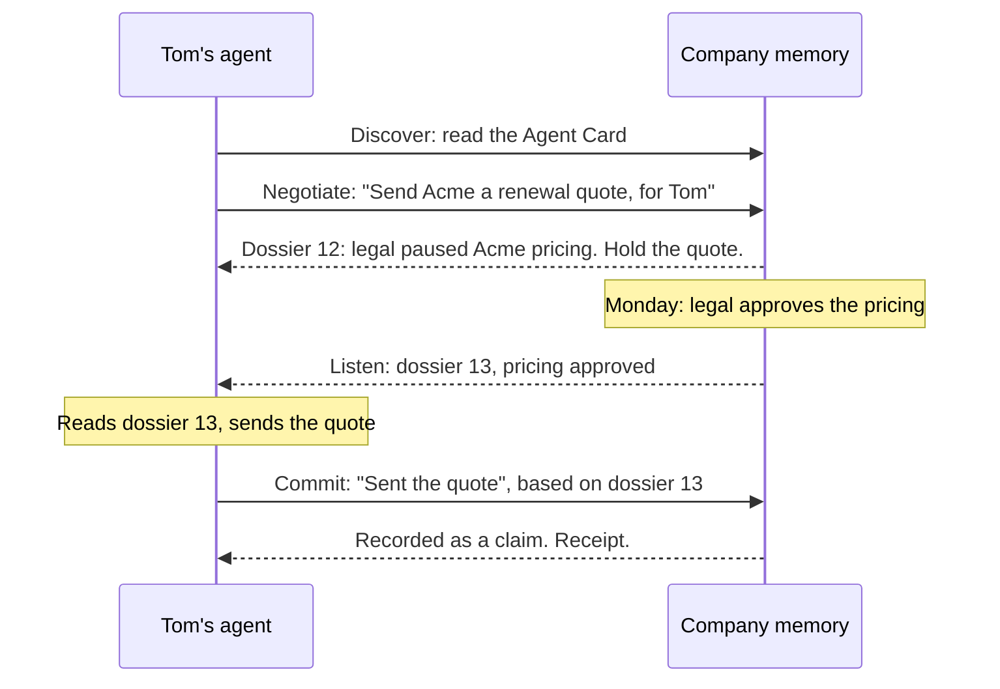

# Mem2A

**Your agents don't know what they shouldn't do. Mem2A is an open protocol that tells them, before they act.**

[](https://github.com/mem2a/mem2a/actions/workflows/ci.yml) · Draft 0.1, open for review · [Apache 2.0](LICENSE)

Legal paused Acme's pricing on Friday. Priya's agent knows. Tom's agent doesn't, and sends Acme the old quote.

Every employee is about to bring an AI agent to work. It's bring-your-own-device all over again, except this time the devices make decisions, and each one remembers only its own user. Mem2A gives every agent, whoever built it, one habit:

1. **Before acting,** it tells the company's memory what it's about to do and for whom. Memory answers with what the agent needs to know: the facts, the precedent, and the rules that apply right now.
2. **While it works,** memory calls back if any of that changes.
3. **After acting,** it reports what it did. Memory records that as a claim until a person or a system of record confirms it.

Bring your own memory: Mem2A is only how agents talk to it. It's an extension to [A2A](https://a2a-protocol.org/), the open protocol agents already use to talk to each other.

> MCP gave agents hands. A2A gave them a voice. Mem2A gives them judgment.

## See it work

```sh
git clone https://github.com/mem2a/mem2a && cd mem2a
python3 -m venv .venv && . .venv/bin/activate
pip install -e "python[dev]"
python examples/acme-quote/demo.py
```

```
    tom | About to send Acme a renewal quote. Asking memory first.
 memory | dossier 12, awaiting-commit: "Hold: Do not send Acme new pricing until legal clears it."
    tom | Holding the quote. Memory will call my webhook if this changes.
  legal | Approves Acme pricing at $1.2M a year (f-340 supersedes f-311).
 memory | push to tom: dossier 13 replaces 12.
        |   - constraint c-17
    tom | No constraints left. Sending the quote.
    tom | Quote sent. Committing against dossier 13.
 memory | receipt cm-1: f-341 recorded as a claim.
 memory | watch for priya: dossier 15 replaces 14.
        |   + fact f-341 (claim by user:tom): Tom sent Acme a renewal quote at $1.2M a year.
  priya | Tom already sent the quote, so no follow-up now. Canceling.
```

(Trimmed; the demo prints every dossier in full.)

Prefer curl, JavaScript or Go? Start a sandbox memory with `mem2a serve --seed acme --dev-admin` and follow the [wire quickstart](docs/wire-quickstart.md): every request, ready to paste.

## Take part

Mem2A is a draft, and now is the cheapest time to change it.

**In five minutes, no code needed**

- **Seen an agent do something it shouldn't have?** [Tell us in three questions](https://github.com/mem2a/mem2a/issues/new?template=use-case.yml).
- **Have an opinion?** Weigh in on an [open question](https://github.com/mem2a/mem2a/issues?q=is%3Aissue+is%3Aopen+label%3A%22open+question%22), such as [how claims get confirmed](https://github.com/mem2a/mem2a/issues/3) or [what rules should look like](https://github.com/mem2a/mem2a/issues/4).
- **Running agents from more than one vendor?** [Become a design partner](https://github.com/mem2a/mem2a/issues/new?template=design-partner.yml).
- **Star the repo** to follow the draft to 1.0.

**If you build things**

| You are | Start here |
| --- | --- |
| Building an agent | [Write an agent in 20 lines](python/README.md#write-an-agent-in-20-lines) · [a complete sales agent](examples/sales-agent) · [the wire quickstart](docs/wire-quickstart.md), for any language |
| Building a memory or knowledge graph | [The implementer's guide](docs/implementers-guide.md) · [test yours with `mem2a-conform`](python/README.md#test-your-own-memory) · [get listed](IMPLEMENTATIONS.md) |
| Into protocols and standards | [The spec](spec/v0.1/mem2a.md) · [propose a change](https://github.com/mem2a/mem2a/issues/new?template=spec-change.yml) · [how decisions get made](GOVERNANCE.md) |
| Into security | [The threat model](docs/threat-model.md) · [try to break the claims model](SECURITY.md) |
| After a first contribution | [Good first issues](https://github.com/mem2a/mem2a/issues?q=is%3Aissue+is%3Aopen+label%3A%22good+first+issue%22) · [help wanted](https://github.com/mem2a/mem2a/issues?q=is%3Aissue+is%3Aopen+label%3A%22help+wanted%22) · [CONTRIBUTING.md](CONTRIBUTING.md) |

## How it works

Memory is an ordinary A2A agent, and each action is one A2A task.



| Step | What happens |
| --- | --- |
| **Discover** | The agent reads memory's Agent Card, which declares Mem2A and how to prove who the agent acts for. |
| **Negotiate** | The agent sends an **intent**: what it's about to do, the things it touches, and who it acts for. Memory answers with a versioned **dossier**, asks a question back, or refuses. |
| **Listen** | While the task is open, memory sends a new dossier version whenever something the agent relied on changes. |
| **Commit** | The agent reports what it did against the version it relied on. Memory records it as a **claim** and tells other agents watching the same things. |

The rules that keep it safe:

- **Claims aren't facts.** Only a person or a system of record can confirm what an agent reports, so one compromised agent can't plant a fact everyone trusts.
- **Rules only come from confirmed things.** An instruction smuggled into one agent can't become every agent's rule.
- **Permissions follow the source.** If Tom couldn't read the email a fact came from, his agent never sees the fact.
- **Memory advises; something else enforces.** Stopping an agent that ignores its dossier is the job of a sandbox or watchdog.
- **Stale reports are refused.** No action is recorded against information that has since changed until the agent has seen the change.

More: [how it works](docs/how-it-works.md), message by message in [the examples](spec/v0.1/examples), and every rule in [the spec](spec/v0.1/mem2a.md).

## What Mem2A is, and isn't

- **It is** a protocol for agents to consult and update a shared company memory, built as an A2A extension.
- **It isn't** a memory product. Bring your own memory system; Mem2A defines how agents talk to it.
- **It isn't** a replacement for MCP or A2A. It sits alongside them.
- **It isn't** a boss agent. Memory never hands out work.
- **It isn't** an enforcement layer. Memory carries the rules; something outside the agent's reach enforces them.

## Why now

In September 2026, OpenAI [held back a flagship model](https://www.aljazeera.com/economy/2026/9/29/openai-scraps-release-of-latest-ai-model-over-safety-concerns) over "scope and authorization", and [demonstrated a prompt injection that copies itself](https://lastweekin.ai/p/last-week-in-ai-345-5-new-models) from one agent to the next. Personal agents are arriving at work anyway. When phones did the same, companies could say yes only once phones had a standard way to receive the company's rules. Agents need the same thing for what the company knows and has decided. [The full case](docs/why.md).

## Status

Draft 0.1. What exists today:

- the [specification](spec/v0.1/mem2a.md), with normative [JSON Schemas](spec/v0.1/schemas) and [worked examples](spec/v0.1/examples);
- a [reference memory and agent client in Python](python), on the official A2A SDK;
- `mem2a-conform`, which checks any running memory against the spec;
- a [threat model](docs/threat-model.md), and [design decision records](adrs).

What's next is on the [roadmap](docs/roadmap.md).

## Who's behind it

Mem2A was started by the team at Sentra, who build company memory. It isn't tied to any product: it's Apache 2.0, conformance is judged against the spec rather than any implementation, and we intend to propose it to the A2A project. We're looking for [co-maintainers from other companies](https://github.com/mem2a/mem2a/issues/19).

## What's in this repo

| Path | What it is |
| --- | --- |
| [`spec/v0.1`](spec/v0.1) | The specification, schemas and worked examples. |
| [`python`](python) | The reference memory, agent client, sandbox server and `mem2a-conform`. |
| [`examples`](examples) | The Acme story in one command, and a standalone sales agent. |
| [`conformance`](conformance) | Checks that the spec's examples follow its rules. |
| [`docs`](docs) | Why, how it works, wire quickstart, implementer's guide, threat model, FAQ and roadmap. |
| [`adrs`](adrs) | Why the design is the way it is. |

## License

[Apache 2.0](LICENSE)
