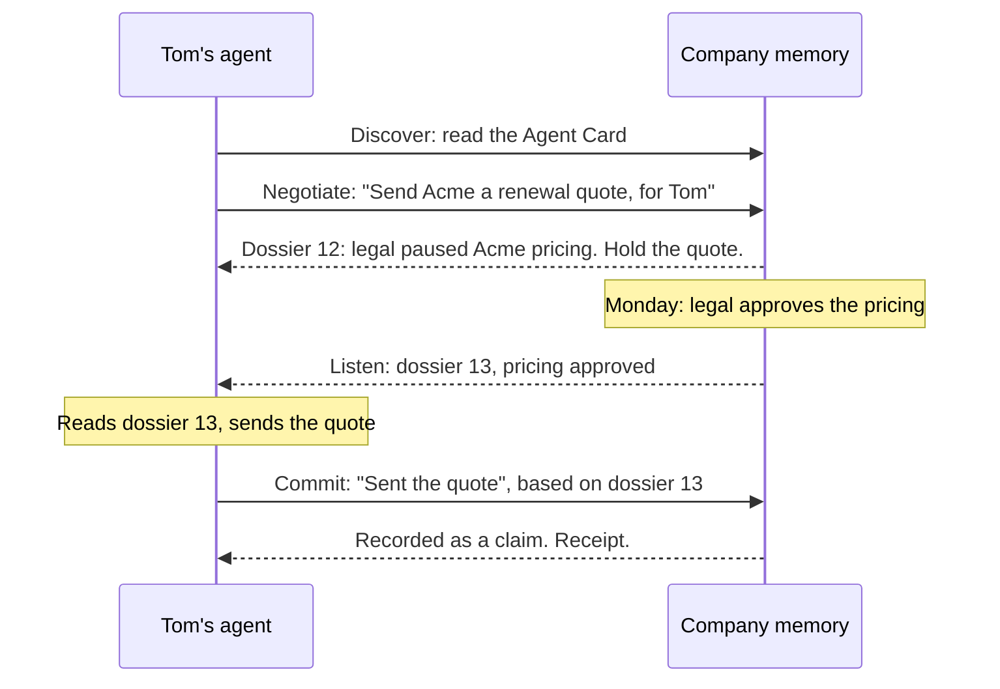

<p align="center">
  
</p>

<h1 align="center">Memory-to-Agent (Mem2A) Protocol</h1>

<p align="center">
  <strong>An open protocol that lets any AI agent consult a company's shared memory before it acts, hear when that changes, and report back after.</strong>
</p>

<p align="center">
  <a href="https://mem2a.github.io/mem2a/">Documentation</a> |
  <a href="spec/v0.1/mem2a.md">Specification</a> |
  <a href="https://github.com/mem2a/mem2a/discussions">Discussions</a> |
  <a href="docs/roadmap.md">Roadmap</a>
</p>

<p align="center">
  <a href="https://github.com/mem2a/mem2a/actions/workflows/ci.yml"></a>
  <a href="https://mem2a.github.io/mem2a/"></a>
  <a href="spec/v0.1/mem2a.md"></a>
  <a href="https://a2a-protocol.org/"></a>
  <a href="python"></a>
  <a href="LICENSE"></a>
</p>

Companies are filling up with AI agents: personal agents that employees bring to work, agents built by internal teams, and agents that ship inside SaaS products. Each remembers only its own user or task. None of them shares a view of what the company has decided, so they act on different versions of the truth and on rules nobody told them about.

Mem2A gives every agent, whoever built it, one shared, company-owned memory to check with. With Mem2A, agents can:

- **Learn what bears on an action before taking it:** the facts, precedent and rules that apply right now, filtered to what the person behind the agent may see.
- **Hear when that changes,** without asking again: memory speaks first.
- **Report what they did,** recorded as claims until a person or a system of record confirms them.
- **Do it with any vendor:** Mem2A is an extension of [A2A](https://a2a-protocol.org/), so any agent that speaks A2A can use any memory that implements Mem2A.

## Why Mem2A?

Your agents don't know what they shouldn't do. Legal paused a customer's pricing on Friday; one agent knows, another doesn't, and sends the old quote.

- **Search can't fix it.** Retrieval answers the questions an agent asks. These failures come from questions it didn't know to ask.
- **Each vendor's memory can't fix it.** Ten agent vendors means ten versions of the truth, and the company starts over every time it switches.
- **It has been solved before.** Phones became safe for work once there was a standard way to give every device the company's rules. Agents need the same for what a company knows and has decided.

[Read the full case](docs/why.md).

## How it works

Memory is an ordinary A2A agent, and each action an agent takes is one A2A task.



| Step | What happens |
| --- | --- |
| **Discover** | The agent reads memory's Agent Card, which declares Mem2A and how to prove who the agent acts for. |
| **Negotiate** | The agent sends an **intent**: what it's about to do, the things it touches, and who it acts for. Memory answers with a versioned **dossier**, asks a question back, or refuses. |
| **Listen** | While the task is open, memory sends a new dossier version whenever something the agent relied on changes. |
| **Commit** | The agent reports what it did, against the latest version it has read. Memory records it as a **claim** and tells the other agents watching the same things, if they may see it. |

## Key features

- **Built on A2A v1.0.** A profile extension: no new methods and no new task states, over JSON-RPC, gRPC or HTTP+JSON.
- **Versioned dossiers.** Every fact, precedent and constraint has an id, a version and a source a person can trace.
- **Memory speaks first.** Updates arrive by push notification or stream; agents read the current version before acting.
- **Claims aren't facts.** What agents report never becomes a rule, never lifts one, and never confirms itself.
- **Permissions follow the source.** An agent never sees what its user couldn't read, checked every time memory sends anything.
- **Ready for enforcement.** Gateways, sandboxes and watchdogs can consult the same memory and stop what an agent shouldn't do.

## Getting started

- **See it in action.** Two agents and a memory, in one command:

  ```sh
  git clone https://github.com/mem2a/mem2a && cd mem2a
  python3 -m venv .venv && . .venv/bin/activate
  pip install -e "python[dev]"
  python examples/acme-quote/demo.py
  ```

- **Read the documentation** at [mem2a.github.io/mem2a](https://mem2a.github.io/mem2a/): [how it works](docs/how-it-works.md), the [A2A primer](docs/a2a-primer.md) and the [glossary](docs/glossary.md), with a suggested [reading order](docs/README.md).
- **Read the specification:** [Mem2A 0.1](spec/v0.1/mem2a.md), with normative [JSON Schemas](spec/v0.1/schemas) and [worked examples](spec/v0.1/examples).
- **Build an agent:** the [Python SDK](python/README.md#write-an-agent), or plain HTTP from any language with the [wire quickstart](docs/wire-quickstart.md).
- **Build a memory:** the [implementer's guide](docs/implementers-guide.md), then test it from the outside with [`mem2a-conform`](python/README.md#test-your-own-memory).
- **Run a tool gateway:** enforce memory for agents that don't speak Mem2A yet, with the [tool gateway example](examples/tool-gateway).

[Who Mem2A is for](docs/ecosystem.md) explains what each kind of participant builds and gets: companies running agents, agent builders, memory providers, tool and integration platforms, and security vendors.

## Contributing

Mem2A is a draft, and now is the cheapest time to change it.

- **Questions and ideas:** start a [discussion](https://github.com/mem2a/mem2a/discussions), or weigh in on an [open question](https://github.com/mem2a/mem2a/issues?q=is%3Aissue+is%3Aopen+label%3A%22open+question%22).
- **Bugs and proposals:** open an [issue](https://github.com/mem2a/mem2a/issues).
- **Use cases:** [tell us about an agent that did something it shouldn't have](https://github.com/mem2a/mem2a/issues/new?template=use-case.yml).
- **Design partners:** running agents from more than one vendor? [Try Mem2A with us](https://github.com/mem2a/mem2a/issues/new?template=design-partner.yml).
- **Contribution guide:** see [CONTRIBUTING.md](CONTRIBUTING.md), and start with a [good first issue](https://github.com/mem2a/mem2a/issues?q=is%3Aissue+is%3Aopen+label%3A%22good+first+issue%22).
- **Private feedback:** use [Sentra's contact page](https://www.sentra.app/contact). Security problems go through [SECURITY.md](SECURITY.md).

## What's next

- An identity profile for delegated tokens and chains of actors ([#11](https://github.com/mem2a/mem2a/issues/11)).
- A profile for gateways that speak Mem2A on an agent's behalf ([#23](https://github.com/mem2a/mem2a/issues/23)).
- A TypeScript client and the schemas on npm ([#13](https://github.com/mem2a/mem2a/issues/13), [#14](https://github.com/mem2a/mem2a/issues/14)), and the Python package on PyPI ([#22](https://github.com/mem2a/mem2a/issues/22)).
- A proposal to the A2A project, to make Mem2A an official extension.

The [roadmap](docs/roadmap.md) has the details.

## About

Mem2A was started by the team at [Sentra](https://sentra.app), who build company memory. It isn't tied to any product: it's licensed under the [Apache License 2.0](LICENSE), conformance is judged against the specification rather than any implementation, and decisions follow an open [governance process](GOVERNANCE.md). We intend to propose it to the A2A project, and we're looking for [co-maintainers from other companies](https://github.com/mem2a/mem2a/issues/19).
