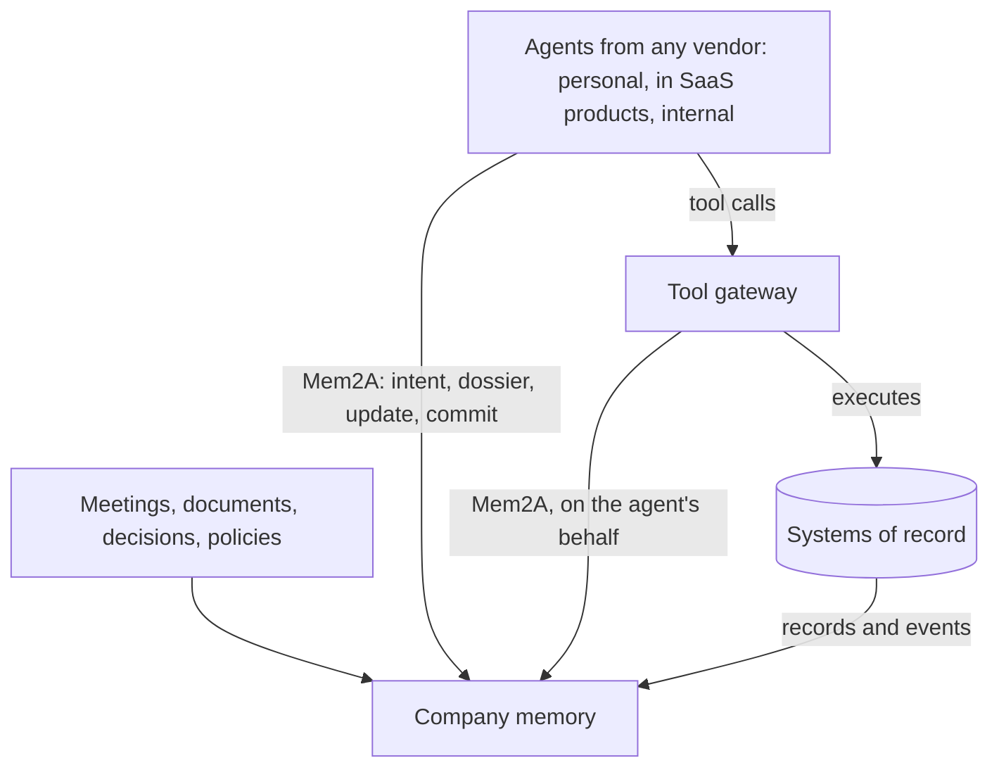

# Who it's for

On the wire, Mem2A has two roles: a memory, and an agent that consults it. Around them are five kinds of organizations, and each one gets something different out of a shared protocol. This page is for deciding where you fit and what you would build.

## Companies running agents

You want to say yes to agents without losing track of what they do.

- **What you get:** one place that tells every agent, whoever built it, what the company has decided and what it may not do right now. A record of what each agent reported doing, against the information it had. And no lock-in: any memory that implements Mem2A works with any agent that speaks it.
- **What you set up:** a memory that speaks Mem2A, your identity provider issuing delegated tokens ([spec 10.2](../spec/v0.1/mem2a.md#10-identity-and-permissions)), the webhook origins you allow each agent, and enforcement at the points agents can't bypass, such as a tool gateway or egress policy ([spec 11.1](../spec/v0.1/mem2a.md#11-security-considerations)).
- **Start with:** [why Mem2A](why.md), the [threat model](threat-model.md), and [becoming a design partner](https://github.com/mem2a/mem2a/issues/new?template=design-partner.yml).

## Agent builders

You ship a personal agent, an agent inside a product, or an internal agent.

- **What you get:** context your agent could never have searched for, such as a legal hold or a precedent from another project, and a reason for enterprises to trust it with real work.
- **What you implement:** the agent side. Negotiate before acting, listen for updates, read the current dossier before acting, commit after ([spec 12.2](../spec/v0.1/mem2a.md#122-agent)). It's a page of code with the [Python SDK](../python/README.md), or plain HTTP from any language ([wire quickstart](wire-quickstart.md)).
- **Show it:** list your agent in [IMPLEMENTATIONS.md](../IMPLEMENTATIONS.md) with the memories you've tested against.

## Memory and knowledge-graph providers

You already hold what a company knows: in a knowledge graph, a context engine, a search index or a records system.

- **What you get:** every agent from every vendor becomes a client of your memory, through one protocol instead of one integration per agent. You compete on what you're good at: which facts, precedent and rules are relevant to an action.
- **What you implement:** the memory side, on top of what you store today ([implementer's guide](implementers-guide.md)). Mem2A constrains the form of a dossier, its permissions and its provenance, never its content ([spec 8.1.7](../spec/v0.1/mem2a.md#81-negotiate)).
- **Show it:** run `mem2a-conform` against your memory and add the result to [IMPLEMENTATIONS.md](../IMPLEMENTATIONS.md).

## Tool and integration platforms

You connect agents to the systems they act on: you hold the credentials, and you execute the calls. That puts you exactly where Mem2A wants enforcement to live. Memory carries the rules but can't stop an agent that ignores them ([ADR 0003](../adrs/0003-memory-carries-rules-enforcement-elsewhere.md)). A gateway on the execution path can.

- **Enforce.** Before executing a tool call, ask memory about it, and hold the call while a `must` constraint applies. An agent can't route around a gateway that holds the credentials it needs.
- **Bring agents along unchanged.** Most agents won't speak Mem2A for a while. A gateway can speak it for them, from the tool calls it sees: the tool becomes the action, its arguments the entities, and the user whose connection runs the call the principal. To memory, the gateway is simply an agent, acting with a delegated token that names the user, with the gateway in the chain of actors ([spec 10.2](../spec/v0.1/mem2a.md#10-identity-and-permissions)).
- **Make reports worth trusting.** A gateway sees the system of record's answer to every call: the id of the email that was sent, or of the record that changed. Commits it makes can carry that as evidence, so a person or the system of record can confirm the claim quickly ([spec 9.3](../spec/v0.1/mem2a.md#9-facts-claims-and-receipts)).

What you would build: the agent side of Mem2A, a mapping from tool calls to intents, and a policy for what happens while a constraint applies: refuse the call, ask a person, or let it through and report the conflict. The [tool gateway example](../examples/tool-gateway/README.md) does all three in one small file.

Gateways are also best placed to settle several open questions: how entities are named across tools ([#5](https://github.com/mem2a/mem2a/issues/5)), how Mem2A works alongside MCP ([#7](https://github.com/mem2a/mem2a/issues/7)), how claims get confirmed without a person in every loop ([#3](https://github.com/mem2a/mem2a/issues/3)), and how a gateway and an agent that both speak Mem2A share one action ([#23](https://github.com/mem2a/mem2a/issues/23)).

## Security, governance and observability

You build sandboxes, egress controls, watchdogs or audit trails for agents.

- **What you get:** policy context that changes in real time, and an independent account of what each agent said it would do and then did.
- **What you implement:** consult the same memory as the agents ([spec 11.1](../spec/v0.1/mem2a.md#11-security-considerations)), and use dossiers, commits and receipts as signals. Nothing in Mem2A asks you to trust the agent.
- **Start with:** the [threat model](threat-model.md), and [SECURITY.md](../SECURITY.md) if you find a way to break it.

## Take part

Mem2A is a draft, and the people building these pieces should shape it. [Become a design partner](https://github.com/mem2a/mem2a/issues/new?template=design-partner.yml), weigh in on an [open question](https://github.com/mem2a/mem2a/issues?q=is%3Aissue+is%3Aopen+label%3A%22open+question%22), or join as a [co-maintainer](https://github.com/mem2a/mem2a/issues/19). To talk privately first, use [Sentra's contact page](https://www.sentra.app/contact).
