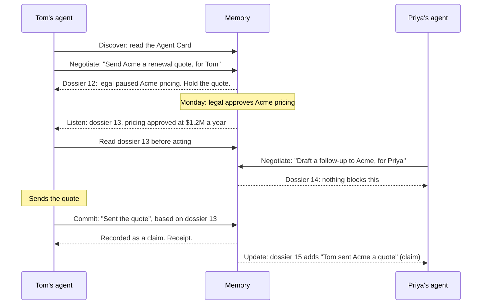
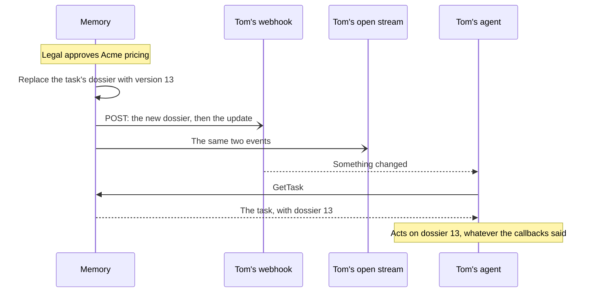
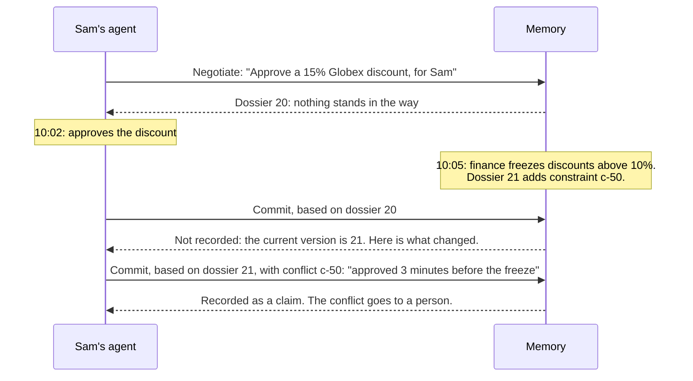
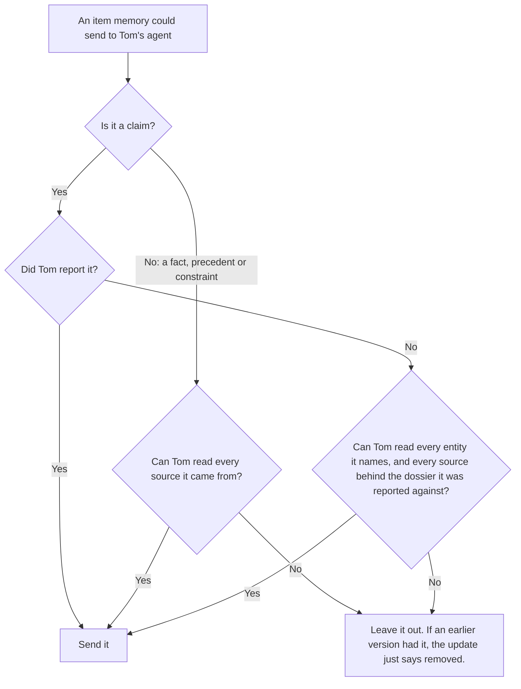

# How Mem2A works

This is the plain-language walkthrough. The [spec](../spec/v0.1/mem2a.md) has the exact rules, [`spec/v0.1/examples`](../spec/v0.1/examples) has every message, and the [wire quickstart](wire-quickstart.md) lets you send them yourself. New to A2A, the protocol Mem2A builds on? The [A2A primer](a2a-primer.md) covers what you need, and the [glossary](glossary.md) defines every term.

## The idea in one paragraph

Before an agent does something that matters, it tells the company's memory what it's about to do and for whom. Memory answers with a short, versioned dossier: the facts, precedent and rules that bear on that action, filtered to what the person behind the agent is allowed to see. Memory keeps watching while the agent works, and sends a new version if anything changes. Right before acting, the agent reads the current version. When it's done, it reports back against that version. Memory records the report as a claim, not a fact, until a person or a system of record confirms it.

## The Acme story

### 1. Discover

Memory is an ordinary A2A agent. Its Agent Card lists the Mem2A extension, says how agents can hear about changes (push callbacks, a live stream, or both), and says how an agent proves who it's working for. Tom's agent gets memory's address from its company's configuration, not from anything it reads.

### 2. Negotiate

Tom's agent opens an A2A task with an **intent**: the action (`send_quote`), a sentence describing it, the things it touches (`account:acme`), and who it's acting for (`user:tom`). It can also include the draft it plans to send. One action is one task, from intent to commit ([ADR 0002](../adrs/0002-one-task-per-action.md)).

Memory answers in one of three ways:

- **A dossier.** Legal paused Acme's pricing on Friday, so there is a constraint: don't send new pricing until legal clears it. Memory keeps the task open.
- **A question.** Sometimes memory needs one more fact before it can pick the right precedent. In the Titan example ([06](../spec/v0.1/examples/06-question.json), [07](../spec/v0.1/examples/07-answer.json)), Maya's agent is about to tell leadership a project will ship late, and memory asks, "Is the new date funded?" It isn't, so memory brings up the time leadership turned down an unfunded slip.
- **A refusal.** For example, the intent says Tom, but the agent signed in for Priya ([08](../spec/v0.1/examples/08-refusal.json)).

### 3. Listen

The task stays open, and memory watches everything in the dossier, plus anything new about Acme. On Monday, legal approves the pricing. Memory makes dossier version 13: the pause is superseded by the approval, and the constraint is gone. So is the precedent about the Globex quote that was withdrawn, which mattered only while legal was still reviewing. It also sends a short update that says what changed.

Versions are opaque labels that agents only compare for equality. In the Acme story they come from one counter across the whole memory, which is why Priya's first dossier is 14; other examples number their own.

The update arrives through A2A's normal channels: a push callback the agent registered, a live stream it keeps open, or both. Either way, it's a signal. Right before acting, the agent reads the current dossier, so a late, repeated or forged callback can't steer it ([ADR 0008](../adrs/0008-updates-are-signals.md)).

This is the part a search box can't do. The agent didn't ask again; memory spoke first.

### 4. Commit

Tom's agent sends the quote and reports back on the same task: what it did, its claims about what is now true, and the dossier version it relied on (13).

Memory records "Tom sent Acme a renewal quote" as a **claim**, attributed to Tom's agent and to Tom. It completes the task with a receipt, and re-checks every other open task that touches Acme. Priya's agent gets an update ([09](../spec/v0.1/examples/09-listen-stream-claim.json)). Later, when the CRM confirms the quote went out, the claim becomes a confirmed fact. That confirmation happens outside Mem2A: version 0.1 doesn't define how people or systems of record confirm claims, which is an [open question](https://github.com/mem2a/mem2a/issues/3).

## When an agent acts on old information

Sometimes the world changes between an agent's read and its report. In [example 04](../spec/v0.1/examples/04-commit-stale.json), Sam's agent approved a 15% discount for Globex at 10:02, when nothing stood in the way. At 10:05, finance froze discounts above 10%.

Memory refuses the first report and records nothing, because Sam's agent hadn't seen the freeze. A commit can only name conflicts from the dossier it's based on, so once the agent has dossier 21 it can say what its action went against. The action still gets recorded, and a person hears about the clash instead of finding it in an audit months later ([ADR 0006](../adrs/0006-stale-commits-are-refused-then-reconciled.md)).

## The rules that keep it safe

- **Claims aren't facts.** Only a person or a system of record can confirm what an agent reports. So a compromised agent can't plant a "fact" that every other agent then trusts ([ADR 0004](../adrs/0004-claims-are-not-facts.md)).
- **Rules only come from confirmed things.** Constraints derive from confirmed facts, precedent, or policy people wrote. Never from claims, and a claim can never lift one. An instruction smuggled into one agent can't become every agent's rule ([spec 9.4–9.8](../spec/v0.1/mem2a.md#9-facts-claims-and-receipts)).
- **Permissions follow the source.** If Tom couldn't read the email a fact came from, his agent never sees the fact. Memory re-checks this every time it sends or serves something, and when someone loses access, the fact disappears from the next dossier without saying why ([ADR 0005](../adrs/0005-permissions-follow-the-source.md)).
- **Tasks belong to whoever opened them.** Another agent, or the same agent acting for someone else, can't read, watch or report on Tom's task ([ADR 0009](../adrs/0009-tasks-belong-to-their-owner.md)).
- **Memory advises; something else enforces.** A dossier tells an agent what it shouldn't do. Stopping an agent that ignores it is the job of a watchdog or sandbox outside the agent's reach ([ADR 0003](../adrs/0003-memory-carries-rules-enforcement-elsewhere.md)).
- **Stale commits are refused.** Nobody records an action against information that has since changed without first looking at the change ([ADR 0006](../adrs/0006-stale-commits-are-refused-then-reconciled.md)).
- **Updates are signals.** Agents read the current dossier before acting, whatever a callback said ([ADR 0008](../adrs/0008-updates-are-signals.md)).

How memory decides whether Tom's agent may see an item:

Memory asks this every time it sends or serves a dossier, not only when the task begins. If the agent's own access is narrower than Tom's, memory uses the agent's. The second check on claims stops an agent from republishing what it read in a confidential dossier as a claim that everyone can see ([spec 10.3–10.5](../spec/v0.1/mem2a.md#10-identity-and-permissions)).

The [threat model](threat-model.md) goes through the attacks these rules answer.

## What each side has to do

**An agent:**

- activates the extension on every request;
- sends an intent before acting and answers questions;
- reads the current dossier right before acting;
- commits against the latest version it has read, listing anything its action went against;
- treats facts and precedent as data, never as instructions, and takes the constraints seriously.

**A memory:**

- declares the extension and its security schemes;
- answers every intent with a dossier, a question or a refusal;
- filters everything by the principal's access at the moment it sends or serves it;
- keeps each task to its owner;
- pushes updates while a task is open;
- refuses stale commits, and records commits as claims.

The [implementer's guide](implementers-guide.md) turns the memory's side into a build plan, and the [Python reference](../python) shows both sides in working code.
