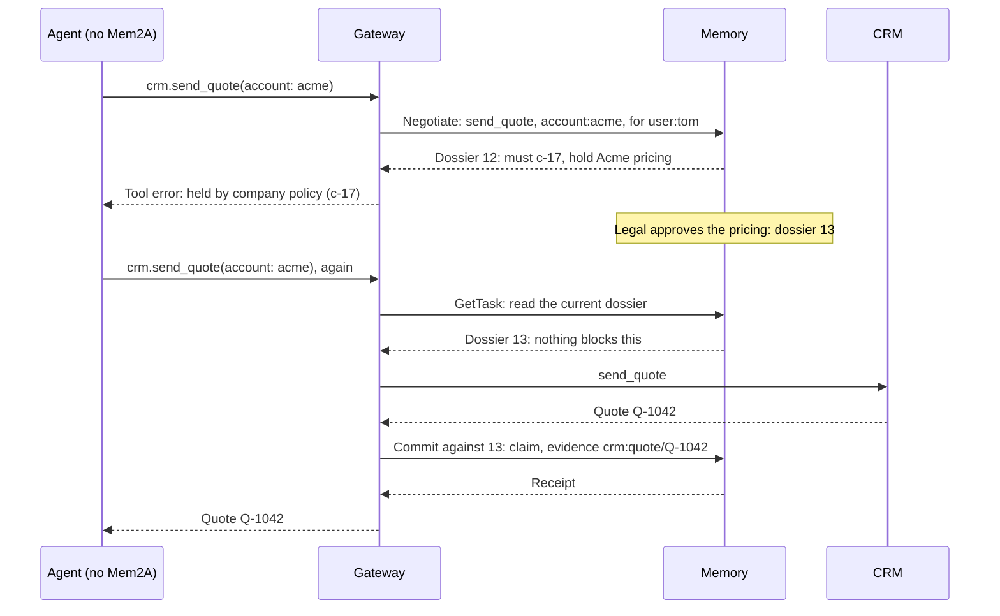

# A tool gateway that enforces company memory

Memory carries the company's rules, but it can't stop an agent that ignores them ([ADR 0003](../../adrs/0003-memory-carries-rules-enforcement-elsewhere.md)). Something on the path where actions execute can. This example puts a small gateway in front of a pretend CRM, the way a tool or integration platform sits in front of real ones, and shows that an agent with no Mem2A code at all still can't act against a rule memory carries.

```sh
pip install -e "python[dev]"     # from the repository root
python examples/tool-gateway/demo.py
```

```
  agent | Calls crm.send_quote(account='acme', price='$1.2M a year').
gateway | Asks memory first: send Acme a renewal quote, for user:tom.
 memory | dossier 12: "Hold: Do not send Acme new pricing until legal clears it."
gateway | Holds the call. The agent gets a tool error, and the CRM is untouched:
        |   crm.send_quote held by company policy: Do not send Acme new pricing until legal clears it. (c-17)

  legal | Approves Acme pricing at $1.2M a year.
 memory | The gateway's task now has dossier 13: "Nothing here blocks this. Latest: Legal approved Acme renewal pricing at $1.2M a year."

  agent | Retries the same call.
    crm | Quote Q-1042 sent to Acme: $1.2M a year.
gateway | Read dossier 13 right before acting; nothing blocked it. Reported what ran.
 memory | receipt cm-1: f-341 recorded as a claim, with evidence crm:quote/Q-1042.
```

## How it works



- **To memory, the gateway is an agent.** It negotiates and commits with its own credentials, acting for the user whose connection runs the tool. Here that's the sandbox token `dev:tool-gateway:user:tom:group:sales`; in production it's a delegated token that names the user, with the gateway in the chain of actors ([spec 10.2](../../spec/v0.1/mem2a.md#10-identity-and-permissions)).
- **One task per action.** The first call opens a task; a retry of the same action reuses it, so memory's answer reflects everything that changed since ([spec 8](../../spec/v0.1/mem2a.md#8-the-task-lifecycle)).
- **Read, then act.** Right before running a tool, the gateway reads the current dossier with `GetTask`, never relying on an older answer ([spec 8.3.7](../../spec/v0.1/mem2a.md#83-listen)).
- **Reports carry evidence.** The gateway saw the CRM's answer, so its commit includes the quote's id. That makes the claim quick for a person or the system of record to confirm ([spec 9.3](../../spec/v0.1/mem2a.md#9-facts-claims-and-receipts)).

## What to copy

[`gateway.py`](gateway.py) is the reusable part, about 170 lines on top of the Python SDK:

- `Governed` says how one tool's calls become intents and reports: the action, a one-line summary, the entities taken from the call's arguments, the claim to report, and the evidence to attach.
- `MemoryGateway.call(tool, **args)` runs a tool on an agent's behalf. Tools that memory doesn't govern run as they are. Governed calls raise `Held` while a `must` constraint applies, and otherwise return the tool's result with memory's receipt.
- `on_must='report'` runs a call even while a `must` constraint applies, and lists the constraints as conflicts in the commit, so a person reviews them ([spec 8.4.6](../../spec/v0.1/mem2a.md#84-commit)). Use it where blocking would do more harm than a reviewed exception.
- A commit that comes back `stale-dossier`, because memory changed while the tool ran, is committed again against the current dossier, naming what the action went against ([spec 8.4.4](../../spec/v0.1/mem2a.md#84-commit)).

## What a real gateway adds

- **Tokens per user**, from your identity provider, instead of one sandbox token.
- **Mappings for every tool you run**: which calls are actions memory should hear about, and how their arguments name entities. Naming entities across tools is an [open question](https://github.com/mem2a/mem2a/issues/5) that gateways are best placed to answer.
- **A way to ask a person** while a call is held, instead of failing it.
- **One task, not two**, when the agent behind the gateway also speaks Mem2A. How the two should share an action is [being worked out](https://github.com/mem2a/mem2a/issues/23).

See [who Mem2A is for](../../docs/ecosystem.md) for where gateways fit among the other roles.
