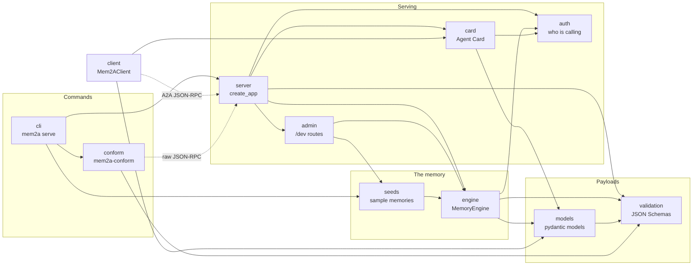
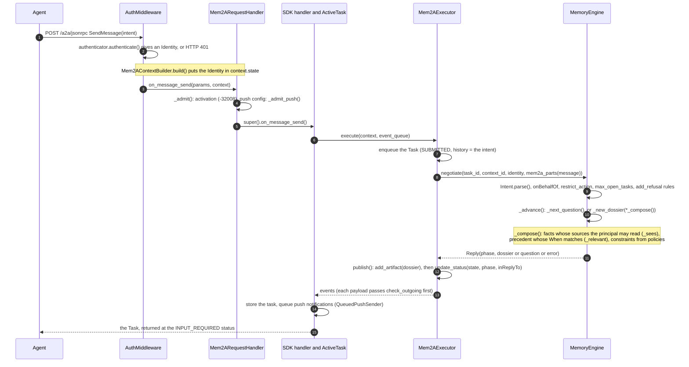
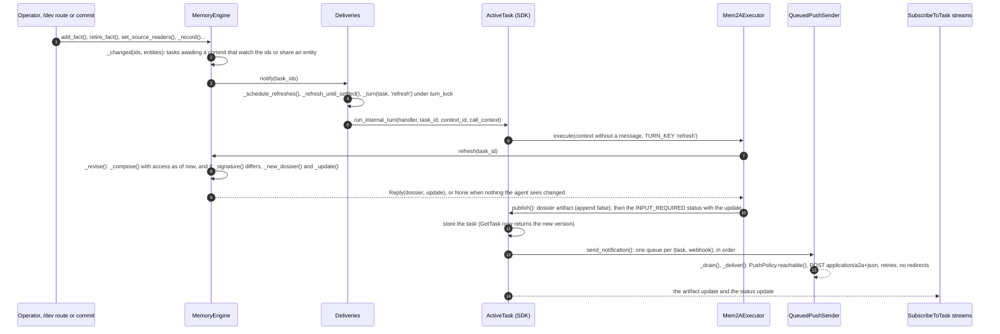
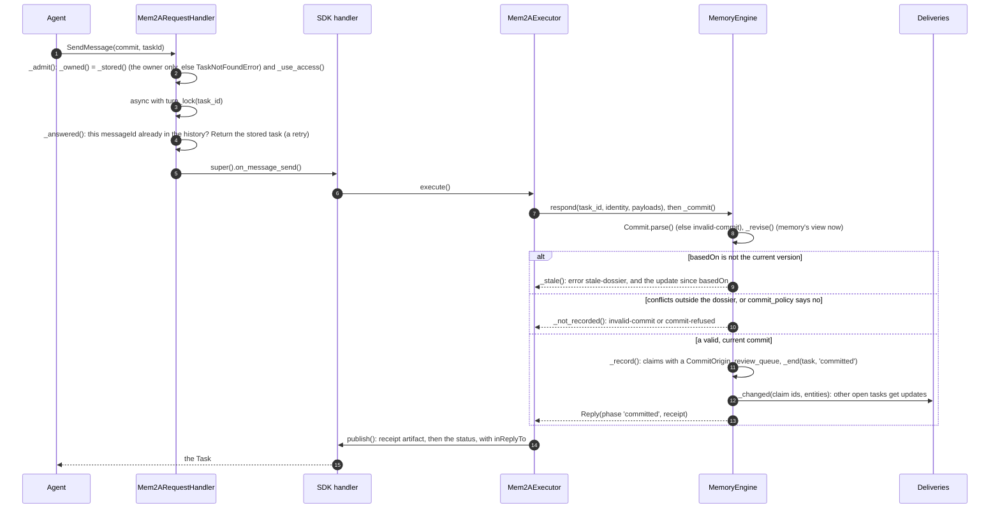

# How the Python reference works

This is for anyone who wants to understand the code, not just use it. It covers the one idea the rest depends on (the internal turn), what each module owns, three paths through the code with the functions involved, where each MUST of the [spec](../spec/v0.1/mem2a.md) is enforced and tested, and how to extend the sandbox.

The package is in [`src/mem2a`](src/mem2a). The memory itself, `MemoryEngine`, knows nothing about A2A. The server adapts it to the [A2A Python SDK](https://github.com/a2aproject/a2a-python) 1.2, which does the protocol work: JSON-RPC, task storage, streams and push notifications.

## The internal turn

**Why it exists.** The SDK runs your agent code, an `AgentExecutor`, only when a client sends a message or cancels a task. Whatever the executor emits, the SDK stores in the task (so `GetTask` sees it), sends to the task's push notification configs, and streams to every `SubscribeToTask` subscriber. A memory must also speak when no client is talking: when a fact changes, every open task that relied on it needs a new dossier and an update, through those same three channels ([spec 8.3.2, 8.3.3](../spec/v0.1/mem2a.md#83-listen)). a2a-sdk 1.2 has no public way to add events to an open task from outside a request.

**How it works.** `server.run_internal_turn(handler, task_id, context_id, call_context)` does what the SDK's own `DefaultRequestHandlerV2.on_message_send` does, minus the message. It takes the task's `ActiveTask` from the handler's private `_active_task_registry` and subscribes to it with a `RequestContext` that has no message. The SDK then treats this like any turn: it queues it behind client turns already running, reloads the task, calls `Mem2AExecutor.execute`, and stores, pushes and streams what the executor emits.

- The call context marks the turn as internal: `state[TURN_KEY]` is `'refresh'` or `'expire'`. The executor then calls `MemoryEngine.refresh` or `MemoryEngine.expire` instead of `negotiate` or `respond`, and leaves `inReplyTo` off the status message, because no agent message is being answered ([7.2.3](../spec/v0.1/mem2a.md#72-phase)).
- The call context's user is the task's owner (`Mem2AUser(record.identity)`), so the SDK's per-owner storage finds the task.
- With no message, nothing is added to the task's history.

**Who starts one.** `Deliveries`, which is registered as the engine's change listener. Every content change ends in `MemoryEngine._changed`, which works out which tasks may be affected and calls the listener. `Deliveries.notify` schedules a refresh per task, coalescing bursts (at most one running and one queued per task). Each refresh runs `Deliveries._turn`, which takes the task's `turn_lock` and calls `run_internal_turn`. Two more sources: `Deliveries.sweep` runs `'expire'` turns for overdue tasks, and `Deliveries.reevaluate` runs a refresh right away when a request arrives with different groups ([10.3](../spec/v0.1/mem2a.md#10-identity-and-permissions)).

**Finished tasks take no turns.** When access changes affect a task that has ended, `_turn` instead calls `Mem2ARequestHandler.restate`, which asks the engine for a re-evaluated dossier (`MemoryEngine.refilter`) and writes it into the stored task directly, with no event.

**Why the lock.** In a2a-sdk 1.2.x, a blocking `SendMessage` returns the first `INPUT_REQUIRED` (or terminal) event on the task's event stream, even if that event comes from an update still being delivered. `Mem2ARequestHandler.turn_lock(task_id)` therefore serializes client follow-ups, cancels and internal turns on each task, so every reply is the reply to its own message.

`_active_task_registry` is the only private SDK attribute the package uses, which is why `pyproject.toml` pins `a2a-sdk>=1.2.1,<1.3`. Re-check `run_internal_turn` before widening the range.

## Module map

Solid arrows are imports and calls; dotted ones go over HTTP. Most modules also import `constants`, and `admin` uses `models` for its types.

| Module | What it owns |
| --- | --- |
| [`engine.py`](src/mem2a/engine.py) | The memory: sources and who may read them, facts, claims, precedent, policies, questions, refusals, tasks. Builds dossiers (`_compose`), checks access (`_sees`), handles answers and commits, works out which tasks a change affects (`_changed`). No A2A. |
| [`server.py`](src/mem2a/server.py) | Everything A2A: `create_app` wiring, `Mem2ARequestHandler` (the Mem2A rules around the SDK's handler), `Mem2AExecutor` (engine replies become A2A events), `Deliveries` and `run_internal_turn`, `QueuedPushSender` and `PushPolicy`, authentication and extension middleware. |
| [`client.py`](src/mem2a/client.py) | `Mem2AClient` for acting agents (negotiate, answer, commit, get, watch, cancel, push configs), and the reading helpers (`dossier_of`, `update_of`, ...). |
| [`models.py`](src/mem2a/models.py) | The payloads as pydantic models with camelCase aliases; `parse` reads as the spec says receivers must (2.5); ISO 8601 durations. |
| [`validation.py`](src/mem2a/validation.py) | The packaged JSON Schemas (byte-identical to the spec's): validation with formats enforced, `known_members` (spec 2.5), `check_outgoing`. |
| [`auth.py`](src/mem2a/auth.py) | `Identity` (agent, principal, groups), the `Authenticator` protocol, and the sandbox's `DevTokenAuthenticator`. |
| [`card.py`](src/mem2a/card.py) | `build_agent_card` and `mem2a_params`. |
| [`constants.py`](src/mem2a/constants.py) | The extension URI, media types, metadata keys, phases and error codes. |
| [`seeds.py`](src/mem2a/seeds.py) | The spec's stories as sample memories (`acme`, `titan`, `empty`), with their dev tokens and intents. |
| [`admin.py`](src/mem2a/admin.py) | The sandbox's unauthenticated `/dev` routes. |
| [`cli.py`](src/mem2a/cli.py) | The `mem2a` command: `mem2a serve` (the sandbox) and `mem2a conform`. |
| [`conform.py`](src/mem2a/conform.py) | `mem2a-conform`, a black-box checker for any memory, over raw JSON-RPC. |

## Three paths through the code

### Negotiate

An agent opens a task with an intent ([spec 8.1](../spec/v0.1/mem2a.md#81-negotiate)).

### An update

Something memory knows changes while tasks are open ([spec 8.3](../spec/v0.1/mem2a.md#83-listen)).

### A commit

The agent acted and reports it ([spec 8.4](../spec/v0.1/mem2a.md#84-commit)).

## Every MUST, where it is enforced, and its test

Spec section numbers refer to [mem2a.md](../spec/v0.1/mem2a.md) (a section's numbered items are its third number: 8.3.7 is item 7 of section 8.3). Rules that bind the agent are marked *agent*: the reference meets them in `Mem2AClient` or the examples. Tests are in [`tests/`](tests): `engine` is test_engine.py, `e2e` test_e2e.py, `payloads` test_payloads.py, `auth` test_auth.py, `conform` the `mem2a-conform` check of that name.

| Section | MUST | Enforced by | Checked by |
| --- | --- | --- | --- |
| 2.4 | Validators enforce `format` | `validation.validator` (`FormatChecker`, with rfc3339 and rfc3986 validators installed) | payloads `test_parse_rejects_what_the_schema_rejects` |
| 2.5 | Senders produce valid payloads | `Mem2AExecutor._part` and `Mem2ARequestHandler.restate` call `check_outgoing` | engine tests (`valid` checks every reply), e2e tests (`wire.check` on every stream event, push body and checked reply), conform `payloads` |
| 2.5 | Receivers ignore unknown members and validate the rest | `validation.known_members`, `Payload.parse`, models' `extra='ignore'` | engine and payloads `test_receivers_ignore_members_this_version_does_not_define`, payloads `test_clients_tolerate_what_a_later_memory_may_add` |
| 2.6 | No JSON numbers | the models (versions are strings), `check_outgoing` | engine `test_versions_are_memory_wide_strings` |
| 5.1, 5.3, 5.6 | Card: the extension, `required`, valid params, capabilities that match `listen`, a security scheme | `card.build_agent_card` | e2e `test_agent_card_declares_mem2a`, payloads `test_agent_card`, conform `card` |
| 6.1, 6.2 | *agent*: activate on every request; list the URI on every message | `Mem2AClient` (`with_a2a_extensions`, `_message`) | `wire.check` on every agent message in e2e |
| 6.3 | Refuse unactivated `SendMessage` without creating a task | `Mem2ARequestHandler._admit` | e2e `test_unactivated_request_gets_32008_and_leaves_no_task`, conform `activation` |
| 6.5 | Every status message and artifact lists the URI | `Mem2AExecutor.publish` | `wire.check`, conform `payloads` |
| 7.1.1 | Exactly one payload per agent message; no decisions on text parts | `server.mem2a_parts` (keeps only Mem2A parts), `engine._single` | engine `test_unexpected_messages_change_nothing`, e2e `test_unexpected_messages_get_an_error` |
| 7.1.2 | A text part in every status message | `Reply.text`, `Mem2AExecutor.publish` | `wire.check` |
| 7.2.1 | The phase, as the table allows | `Mem2AExecutor.publish` (`TASK_STATE`) | `wire.check`, conform `payloads` |
| 7.2.3 | `inReplyTo` on replies, none on updates | `Mem2AExecutor.execute` (`in_reply_to` only for client turns) | e2e `test_replies_name_the_message_they_answer`, conform `negotiate`, `listen` and `access` |
| 7.3.1, 7.3.2 | The `dossier` and `receipt` artifacts, replaced whole | `Mem2AExecutor.publish` (`artifact_id`, `append=False`) | e2e `test_acme_story_with_push_and_subscribe`, conform `payloads` |
| 7.4.1 | One version, one content | `MemoryEngine._new_dossier` (a memory-wide counter; every new content, even a re-evaluated finished task's, gets a new version) | engine `test_versions_are_memory_wide_strings`, `test_finished_tasks_follow_access_without_updates` |
| 7.5 | The message-handling table | `MemoryEngine.negotiate`, `respond`, `_unexpected`; `Mem2ARequestHandler._answered`; the SDK for terminal tasks | engine `test_unexpected_messages_change_nothing`, `test_refusals`; e2e `test_unexpected_messages_get_an_error`, `test_retries_return_the_first_result`; conform `unexpected message` |
| 8.1.2, 8.1.3 | Authenticate; a dossier, a question or a refusal, with the listed codes | `AuthMiddleware`; `MemoryEngine.negotiate`, `_advance`, `_refuse` | engine `test_refusals`; e2e `test_refusals`, `test_open_task_limit`; conform `refusals`, `negotiate` |
| 8.1.4 | The dossier artifact before the status | `Mem2AExecutor.publish` (artifacts first) | conform `negotiate` (on a `SendStreamingMessage`), e2e `test_acme_story_with_push_and_subscribe` |
| 8.1.5 | Only items the principal may see; `watching` exact | `MemoryEngine._compose`, `_sees`, `_new_dossier` | engine `test_permissions_follow_every_source`, conform `dossier rules` |
| 8.1.6 | `expiresAt` on every dossier and question | `MemoryEngine._advance`, `_new_dossier`, `QuestionRule.model` | engine `test_titan_dossier_matches_the_spec_example`, e2e `test_watch_expires` |
| 8.2.2 | Answers: `unknown-question`, `invalid-answer`, the question repeated | `MemoryEngine._answer`, `_still_asking` | engine `test_invalid_answers_and_commits_keep_the_phase`, e2e `test_titan_question_then_answer` |
| 8.3.1 | Watch every item in `watching` | `MemoryEngine._changed` | engine `test_changes_notify_only_affected_tasks`, `test_question_phase_is_not_watched` |
| 8.3.2 | A new dossier when content changes, then the update; never for wording alone | `MemoryEngine.refresh`, `_revise`, `_signature`; `Deliveries` | engine `test_updates_follow_item_versions`, `test_wording_alone_never_produces_an_update`; conform `listen` |
| 8.3.3 | Deliver on every push config and stream; `GetTask` reflects it | `run_internal_turn`; `on_get_task` waits for `Deliveries.settle` | e2e `test_acme_story_with_push_and_subscribe`, conform `listen`, `reads` |
| 8.3.4 | An item that became invisible is only `removed` | `MemoryEngine._diff`, `_update_summary`, `_access_changed` (drops notes) | engine `test_lost_access_reads_exactly_like_retirement`, e2e `test_revoked_access_shows_as_removed`, conform `access` |
| 8.3.5 | Re-check access for each update | `MemoryEngine.refresh` (composes at delivery time) | e2e `test_revoked_access_shows_as_removed` |
| 8.3.7 | *agent*: read the current dossier before acting | `Mem2AClient.get`, `watch` (a stream held open); the demo and the sales agent | `examples/acme-quote/demo.py`, `examples/sales-agent/agent.py --self-test` |
| 8.3.10 | Push only to origins registered for the agent; no redirects; authenticate; in order; never delay replies | `PushPolicy.refusal`, `Mem2ARequestHandler._admit_push`; `QueuedPushSender` | e2e `test_push_origins_are_registered_per_agent`, `test_registered_host_names_are_checked_where_they_point`, `test_push_does_not_follow_redirects`, `test_push_runs_in_the_background_with_retries`, `test_acme_story_with_push_and_subscribe` (headers); conform `listen` |
| 8.3.11 | The watch ends at a terminal state | `MemoryEngine._end`, `expire`; `Deliveries.sweep` | engine `test_cancel_and_expiry`; e2e `test_cancel_ends_the_watch`, `test_watch_expires` |
| 8.4.2 | `invalid-commit`, task unchanged | `MemoryEngine._commit` | engine `test_invalid_answers_and_commits_keep_the_phase`, `test_conflicts_must_name_items_of_the_dossier`; conform `invalid commit` |
| 8.4.3 | Stale: record nothing, `stale-dossier` with `currentVersion` | `MemoryEngine._commit`, `_stale` | engine `test_stale_commit_records_nothing`, `test_commit_before_the_update_arrives_is_stale`; e2e `test_stale_commit_records_nothing_then_good_commit`; conform `stale commit` |
| 8.4.4 | *agent*: read and commit again after `stale-dossier` | `Mem2AClient.commit` (returns the current dossier); the sales agent | e2e `test_stale_commit_records_nothing_then_good_commit` |
| 8.4.5 | Claims recorded as claims; nothing confirmed, retired or lifted; conflicts recorded; other tasks re-evaluated; the receipt, then COMPLETED | `MemoryEngine._record`; `Mem2AExecutor.publish` | engine `test_commit_records_claims_and_conflicts`, `test_replaces_is_only_a_hint`; e2e `test_priya_hears_about_toms_claim`; conform `commit and retry` |
| 8.4.8 | A retried messageId is not processed again | `Mem2ARequestHandler._answered` | e2e `test_retries_return_the_first_result`, conform `commit and retry` |
| 8.5.2 | Cancel ends the watch and records nothing | `MemoryEngine.cancel`, `Mem2AExecutor.cancel` | e2e `test_cancel_ends_the_watch`, conform `cancel` |
| 8.6.1 | FAILED, `internal`, no internal details | `Mem2AExecutor.execute` and `_fail`, `MemoryEngine.fail`; `_no_leaks` outside turns | e2e `test_errors_fail_the_task_without_leaking` |
| 9.2 | `confirmedBy` on confirmed facts; `claimedBy` and an `agent-commit` source on claims | `MemoryEngine._fact_model`, `_record` | engine `test_acme_dossiers_match_the_spec_examples`, `test_claims_never_become_constraints` |
| 9.3 | A commit never confirms | `MemoryEngine._record` (status `claim`); `confirm_fact` is outside the protocol | engine `test_commit_records_claims_and_conflicts` |
| 9.4 | Constraints never from claims | `MemoryEngine._compose` (bases are confirmed facts and precedent) | engine `test_claims_never_become_constraints`, conform `dossier rules` |
| 9.5 | Precedent never from claims or commits; it cites a source and its relevance | `MemoryEngine.add_precedent` (`_check_new_item` refuses agent-commit sources), `_precedent_model` | engine `test_ids_are_shared_across_kinds_and_urls_are_https` |
| 9.7, 9.8 | Superseded facts leave dossiers; only confirmed facts supersede; a claim lifts nothing | `MemoryEngine.add_fact`; `_record` (`replaces` goes to the review queue) | engine `test_retired_and_superseded_facts_leave_dossiers`, `test_replaces_is_only_a_hint`, `test_claims_never_become_constraints` |
| 9.9 | Memory's text never presents a claim as confirmed | `default_summary`, the notes in `_record` | e2e `test_priya_hears_about_toms_claim` |
| 10.1 | Authenticate every request | `AuthMiddleware` | e2e `test_unauthenticated_requests_get_401` |
| 10.2 | Agent and principal from the credential; `onBehalfOf` checked | `Authenticator` (`DevTokenAuthenticator.parse`); `MemoryEngine.negotiate` | auth tests; engine `test_refusals`; conform `refusals` |
| 10.3 | Permissions follow every source, as of each request; stored dossiers re-evaluated | `MemoryEngine._sees`, `_compose`, `use_access`, `refilter`; `Mem2ARequestHandler._owned`, `_use_access`, `restate`; `Deliveries._turn` | engine `test_permissions_follow_every_source`, `test_a_request_with_other_groups_re_evaluates_an_open_task`, `test_finished_tasks_follow_access_without_updates`; e2e `test_reads_use_the_access_of_each_request`, `test_a_commit_against_what_get_task_returned_is_recorded`, `test_finished_tasks_follow_access_without_events`; conform `access` |
| 10.4 | No side doors | refusal texts name no items; summaries are built from visible items; `visibility` is never sent | e2e `test_refusals`, `test_revoked_access_shows_as_removed` |
| 10.5 | Claims visible only to the claimant, or to readers of every entity and every item the commit relied on | `MemoryEngine._sees` (`CommitOrigin.context`, `set_entity_readers`) | engine `test_claim_visibility`, `test_claims_cannot_launder_what_the_claimant_read` |
| 10.6 | Drafts stay in their task | the engine never reads `intent.draft` | engine `test_drafts_stay_in_their_task` |
| 10.7 | Task binding: everyone else gets `TaskNotFoundError` | `Mem2AUser.user_name` (the SDK stores tasks per owner); `Mem2ARequestHandler._stored`, `_owned` | e2e `test_only_the_task_owner_can_touch_it` (9 operations), `test_other_principals_do_not_see_the_task_listed`; conform `binding` |
| 10.7 | Stop delivering when the delegation is revoked | not covered: dev tokens can't be revoked. A real `Authenticator` would have to tell the engine | none |
| 11.3 | Access filtering before any model sees candidates | `MemoryEngine._compose` filters before `summarize` (the one pluggable step that could be a model) | engine `test_summaries_only_see_what_the_principal_may_see` |
| 11.4 | Push only to registered origins, no redirects; never fetch URLs from sources or evidence | as 8.3.10; no code fetches a source's or evidence's URL | as 8.3.10 |
| 11.5 | Relevance from visible items only | `MemoryEngine._compose` (`_relevant` sees only visible confirmed facts) | engine `test_permissions_follow_every_source` |

## Where to start reading

1. [`engine.py`](src/mem2a/engine.py), top to bottom: the module docstring states the memory's rules, then `MemoryEngine.negotiate`, `_compose`, `_sees`, `refresh`, `_commit`, `_record` and `_changed`. [`test_engine.py`](tests/test_engine.py) is the same rules as examples, without A2A.
2. [`server.py`](src/mem2a/server.py): `create_app` shows how the pieces connect; then `Mem2AExecutor.execute` and `publish`, `Mem2ARequestHandler`, `Deliveries` and `run_internal_turn`.
3. [`client.py`](src/mem2a/client.py): `Mem2AClient.watch` and the reading helpers.
4. [`test_e2e.py`](tests/test_e2e.py) runs everything over real HTTP. [`conftest.py`](tests/conftest.py) starts a memory and a webhook receiver on localhost sockets in the test's event loop, so a test can change memory directly and watch updates arrive.

## Extending the sandbox

**Add a seed.** In [`seeds.py`](src/mem2a/seeds.py), write a function that fills a `MemoryEngine`: `add_source` (with `readers`), `add_fact`, `add_precedent` (with `When` conditions), `add_policy`, `add_question`. Register it in `SEEDS` with a description and the first dossier version. `mem2a serve --seed <name>` offers it at once (the choices come from `SEEDS`). If the story needs its own agent, add its dev token and intent next to Tom's, and show them in `cli.banner`, which prints Tom's and Priya's tokens (and Maya's for `titan`).

**Add an admin route.** In [`admin.py`](src/mem2a/admin.py), inside `admin_routes`, write an `async def` that reads the body with `_body`, `_text` and `_texts`, and makes its engine call through `change(lambda: engine....)`. `change` applies the call, waits until the updates it causes are delivered, and answers `{"ok": true, "updatedTasks": [...]}`. Raise `_Invalid(message, status)` for a bad request. Register the handler, wrapped in `_json`, in the returned list. Then list it in the module docstring, in `cli.banner`, and in [README.md](README.md#change-memory-while-tasks-are-open), and add a case to `test_dev_admin_routes`.
