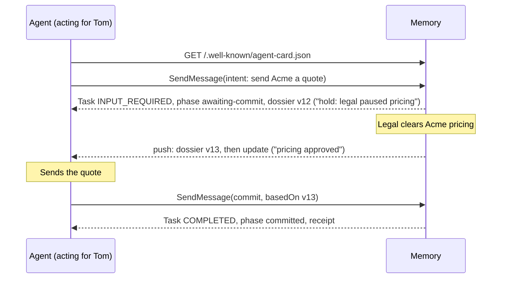

# Mem2A: a memory-to-agent protocol

| | |
| --- | --- |
| **Version** | 0.1 (draft) |
| **Extension URI** | `https://w3id.org/mem2a/v0.1` |
| **Status** | Draft for discussion. Expect breaking changes before 1.0. Every breaking revision gets a new URI. |
| **Builds on** | [A2A Protocol](https://a2a-protocol.org/) v1.0 |
| **Schemas** | [`schemas/`](schemas) (JSON Schema 2020-12, normative) |
| **Examples** | [`examples/`](examples) (non-normative) |

## Abstract

Mem2A lets any agent consult a company's shared memory before it acts, hear from that memory when what it was told changes, and report back after it acts.

Mem2A is an A2A profile extension. The memory is an ordinary A2A agent, and each action an agent takes is one A2A task. The agent states its intent. Memory answers with a versioned dossier. While the task is open, memory sends a new version whenever something in it changes. After acting, the agent commits what it did against the version it relied on.

## Contents

1. [Introduction](#1-introduction)
2. [Conventions](#2-conventions)
3. [Terminology](#3-terminology)
4. [Overview](#4-overview)
5. [Discovery](#5-discovery)
6. [Activation](#6-activation)
7. [Messages and payloads](#7-messages-and-payloads)
8. [The task lifecycle](#8-the-task-lifecycle)
9. [Facts, claims and receipts](#9-facts-claims-and-receipts)
10. [Identity and permissions](#10-identity-and-permissions)
11. [Security considerations](#11-security-considerations)
12. [Conformance](#12-conformance)
13. [Relationship to MCP and A2A](#13-relationship-to-mcp-and-a2a)
14. [Open questions](#14-open-questions)
15. [References](#15-references)
- [Appendix A. Worked example](#appendix-a-worked-example)
- [Appendix B. Changes](#appendix-b-changes)

## 1. Introduction

*This section is non-normative.*

### 1.1 The problem

Companies are filling up with agents that remember only their own user or their own task: personal agents that employees bring to work, specialist agents built by teams, and agents that ship inside SaaS products. None of them shares a view of what the company has decided, and none of them reports to anyone.

The results are predictable. Two agents act on different versions of the truth. An agent does something the company's current rules don't allow, because nobody told it the rules. What one agent learns stays in its session.

Search-style memory, such as retrieval over documents or MCP resources, answers the questions an agent asks. Most of these failures come from questions the agent didn't know to ask. Mem2A turns memory around: the agent says what it is about to do, memory tells it what it needs to know, and memory speaks first when that changes.

### 1.2 Design goals

1. **Memory speaks first.** An agent learns about changes without asking again.
2. **Any vendor.** Mem2A is built on A2A, so an agent from any vendor can use any memory that implements it.
3. **One task per action.** The task is the unit of watching, audit and cleanup.
4. **Memory carries the rules; enforcement lives elsewhere.** Anything an agent can read, it can try to game. Blocking an action is the job of a sandbox or watchdog outside the agent's reach.
5. **Permissions follow the source.** An agent never sees what its principal couldn't read.
6. **Every fact has a receipt.** What an agent reports stays a claim until a person or a system of record confirms it.

### 1.3 Non-goals

- **A memory product or storage format.** Mem2A defines how agents talk to a memory, not how the memory stores or learns.
- **An enforcement layer.** See goal 4.
- **Orchestration.** Memory never hands out work.
- **A replacement for MCP or A2A.** See [section 13](#13-relationship-to-mcp-and-a2a).

## 2. Conventions

The key words "MUST", "MUST NOT", "REQUIRED", "SHALL", "SHALL NOT", "SHOULD", "SHOULD NOT", "RECOMMENDED", "NOT RECOMMENDED", "MAY", and "OPTIONAL" in this document are to be interpreted as described in BCP 14 [[RFC2119](#15-references)] [[RFC8174](#15-references)] when, and only when, they appear in all capitals, as shown here.

- "A2A" means the A2A Protocol v1.0 [[A2A](#15-references)]. Agent Card, Task, Message, Part, Artifact, `SendMessage`, `SubscribeToTask`, push notification and the `TASK_STATE_*` states have the meanings defined there.
- Examples use A2A's JSON-RPC binding and its JSON field names (lowerCamelCase). Mem2A works over any A2A binding.
- `URI` means the extension URI, `https://w3id.org/mem2a/v0.1`.
- The JSON Schemas in [`schemas/`](schemas) are normative. If this text and a schema disagree, please report it; until it is fixed, the stricter reading applies.

## 3. Terminology

| Term | Meaning |
| --- | --- |
| **Memory** | An A2A agent that holds a company's shared memory and implements this extension as a server. |
| **Agent** | An A2A client that is about to take an action and uses Mem2A first. |
| **Principal** | The person, group or system an agent acts for. |
| **Intent** | What an agent is about to do, the things it touches, and who it acts for. |
| **Fact** | A statement memory holds, with an id, a version, a source and a status. |
| **Confirmed fact** | A fact that a person or a system of record stands behind. |
| **Claim** | A fact reported by an agent and not yet confirmed. |
| **Source** | Where a fact, precedent or constraint came from: its receipt. |
| **Precedent** | An earlier decision that bears on an intent. |
| **Constraint** | A rule that applies to an intent right now, derived from confirmed facts, precedent or policy. |
| **Dossier** | Memory's versioned answer to an intent: the relevant facts, precedent and constraints. |
| **Watch** | The set of items a task's dossier depends on. |
| **Commit** | An agent's report of what it did, against a dossier version. |
| **Receipt** | Memory's record of an accepted commit. |

## 4. Overview

*This section is non-normative.*

| Step | A2A primitive | What happens |
| --- | --- | --- |
| Discover | Agent Card | Memory declares the Mem2A extension, how agents can listen for changes, and how an agent proves who it acts for. |
| Negotiate | `SendMessage` opens a task | The agent sends an intent. Memory answers with a dossier, asks a question back, or refuses. |
| Listen | Push notifications, `SubscribeToTask` | While the task is open, memory sends a new dossier version whenever something the agent relied on changes. |
| Commit | `SendMessage` on the same task | The agent reports what it did against the dossier version it used. Memory records it as a claim and completes the task. |

## 5. Discovery

1. A memory MUST declare the extension in its Agent Card, in `capabilities.extensions`, with `uri` equal to `URI` and `params` valid against [`extension-params.schema.json`](schemas/extension-params.schema.json).
2. A memory that accepts only Mem2A traffic SHOULD set `required` to `true`.
3. If `params.listen` contains `push`, the card MUST set `capabilities.pushNotifications` to `true`, and the memory MUST support A2A push notifications for Mem2A tasks. If `params.listen` contains `subscribe`, the card MUST set `capabilities.streaming` to `true`, and the memory MUST support `SubscribeToTask` for Mem2A tasks. A memory SHOULD support both.
4. A memory SHOULD advertise skills with the ids `negotiate` and `commit` ([example 01](examples/01-agent-card.json)). Skills are descriptive only: Mem2A behavior is selected by payloads, not by skill ids.
5. A memory MUST declare at least one security scheme and security requirement in its Agent Card ([section 10](#10-identity-and-permissions)).
6. An agent SHOULD read the Mem2A entry and its `params` before its first request.

## 6. Activation

1. On every request in a Mem2A task, the agent MUST request activation of the extension through the binding's service parameters: the `A2A-Extensions` header in HTTP-based bindings, or request metadata in gRPC.
2. Every message the agent sends in a Mem2A task MUST list `URI` in `message.extensions`.
3. If memory receives a `SendMessage` or `SendStreamingMessage` that carries a Mem2A payload but does not request activation, it MUST respond with A2A's `ExtensionSupportRequiredError`. A memory whose card sets `required: true` MUST respond the same way to any message that does not request activation. In both cases memory SHOULD NOT create a task.
4. Memory SHOULD list the extensions it activated in the response's service parameters: the `A2A-Extensions` response header in HTTP-based bindings.
5. Every status message and artifact memory produces in a Mem2A task MUST list `URI` in its `extensions`.

## 7. Messages and payloads

### 7.1 Payload parts

Mem2A payloads travel as A2A data parts. Each has a `mediaType` that names its kind, and a `data` value that MUST validate against the schema for that kind.

| Payload | `mediaType` | Schema | Sent by | Carried in |
| --- | --- | --- | --- | --- |
| Intent | `application/vnd.mem2a.intent+json` | [intent](schemas/intent.schema.json) | Agent | The first message of a task |
| Answer | `application/vnd.mem2a.answer+json` | [answer](schemas/answer.schema.json) | Agent | A follow-up message |
| Commit | `application/vnd.mem2a.commit+json` | [commit](schemas/commit.schema.json) | Agent | A follow-up message |
| Dossier | `application/vnd.mem2a.dossier+json` | [dossier](schemas/dossier.schema.json) | Memory | The `dossier` artifact |
| Question | `application/vnd.mem2a.question+json` | [question](schemas/question.schema.json) | Memory | A status message |
| Update | `application/vnd.mem2a.update+json` | [update](schemas/update.schema.json) | Memory | A status message |
| Receipt | `application/vnd.mem2a.receipt+json` | [receipt](schemas/receipt.schema.json) | Memory | The `receipt` artifact |
| Error | `application/vnd.mem2a.error+json` | [error](schemas/error.schema.json) | Memory | A status message |

1. Each message the agent sends MUST contain exactly one Mem2A payload part. It MAY also contain text parts for people. Memory MUST NOT base protocol decisions on text parts.
2. Memory's status messages SHOULD include a text part that says the same thing in plain language, so that a person, or an agent without Mem2A support, can follow the task history.

### 7.2 Phase

1. Every status message memory produces in a Mem2A task MUST carry the metadata key `https://w3id.org/mem2a/v0.1/phase`. Its value MUST be one the table allows for the task's state:

   | Phase | Task state | Meaning | The agent's next move |
   | --- | --- | --- | --- |
   | `question` | `TASK_STATE_INPUT_REQUIRED` | Memory asked a question. | Send an answer. |
   | `awaiting-commit` | `TASK_STATE_INPUT_REQUIRED` | Memory delivered a dossier and is watching it. | Act, then commit. Or cancel. |
   | `committed` | `TASK_STATE_COMPLETED` | Memory recorded the commit. | None. |
   | `refused` | `TASK_STATE_REJECTED` | Memory declined the intent. | None. The error part says why. |
   | `expired` | `TASK_STATE_CANCELED` | The watch timed out without a commit. | Start a new task if still needed. |
   | `canceled` | `TASK_STATE_CANCELED` | The agent canceled the task. | None. |

2. Mem2A adds no task states and no RPC methods. It qualifies A2A's states with the phase, which is how A2A extensions are meant to add sub-states.

### 7.3 Artifacts

1. The dossier MUST be carried in an artifact whose `artifactId` and `name` are both `dossier`, containing exactly one dossier part. When the dossier changes, memory MUST replace the artifact whole (same `artifactId`, `append` false) with a dossier whose `version` differs from every earlier version in the task.
2. The receipt MUST be carried in an artifact whose `artifactId` and `name` are both `receipt`, containing exactly one receipt part.

### 7.4 Identifiers and versions

1. Versions (a dossier's `version`, a fact's `version`, a commit's `basedOn`) are opaque strings. Receivers MUST compare them for equality only. Senders MUST NOT use JSON numbers for them: A2A carries data parts as protobuf `Value`s, which turn integers into doubles.
2. Entity and principal references are strings. The RECOMMENDED form is `<type>:<id>`, for example `account:acme` or `user:tom`. Naming entities consistently across tools and companies is an [open question](#14-open-questions).
3. Receivers MUST ignore `metadata` keys they don't understand.
4. Other numbers, such as a receipt's `conflictsRecorded`, can arrive as doubles for the same reason. Receivers MUST accept an integral value written with a zero fraction (`0.0` for `0`).

## 8. The task lifecycle

### 8.1 Negotiate

1. Before acting, the agent MUST send a `SendMessage` (or `SendStreamingMessage`) with no `taskId`, containing one intent. It MAY include a push notification config in `configuration.taskPushNotificationConfig` ([8.3](#83-listen)).
2. Memory MUST authenticate the request ([10.1](#10-identity-and-permissions)) and then respond with exactly one of:
   1. **A dossier:** the `dossier` artifact, followed by a status of `TASK_STATE_INPUT_REQUIRED` with phase `awaiting-commit`.
   2. **A question:** a status of `TASK_STATE_INPUT_REQUIRED` with phase `question`, containing one question part.
   3. **A refusal:** a status of `TASK_STATE_REJECTED` with phase `refused`, containing one error part.
3. Memory MUST refuse, with the error code shown, when:
   - the intent does not validate: `invalid-intent`;
   - `intent.onBehalfOf` is not the principal established by authentication ([10.2](#10-identity-and-permissions)): `principal-mismatch`;
   - the principal may not use memory for this kind of action: `not-authorized`.

   Memory MAY refuse for other reasons with the code `refused`, as long as the refusal doesn't reveal anything the principal can't see ([10.4](#10-identity-and-permissions)).
4. Memory MUST emit the dossier artifact before the status update that moves the task to `awaiting-commit`, so that a blocking `SendMessage` response contains the dossier.
5. The dossier MUST contain only items the principal may see ([10.3](#10-identity-and-permissions)), and its `watching` MUST list the id of every fact, precedent and constraint it contains.
6. What goes into a dossier (which facts, which precedent, which constraints) is memory's judgment. This specification constrains its form, its permissions and its provenance, not its content.

### 8.2 Answer

1. To answer a question, the agent MUST send a `SendMessage` with the task's `taskId` and `contextId`, containing one answer whose `questionId` is the question's `id`.
2. Memory MUST then respond as in [8.1.2](#81-negotiate). If `questionId` is not the open question, memory MUST keep the task in phase `question` and include an error with code `unknown-question`. If the answer doesn't validate, the code is `invalid-answer`. In both cases the status MUST repeat the open question part next to the error, so that the task's current status always carries the question.
3. Memory MAY limit how many questions it asks. It SHOULD ask only when the answer changes what goes into the dossier.

### 8.3 Listen

1. While a task is in phase `awaiting-commit`, memory MUST watch every id in the dossier's `watching`. It SHOULD also watch for new items relevant to the intent, such as new facts about the intent's entities.
2. When a watched item changes, is retired or superseded, or becomes invisible to the principal, or when memory learns something new that it judges relevant, memory MUST prepare a new dossier. If its content differs from the current dossier, memory MUST:
   1. replace the `dossier` artifact with the new version ([7.3.1](#73-artifacts)), and then
   2. emit a status of `TASK_STATE_INPUT_REQUIRED` with phase `awaiting-commit`, containing one update part that lists the changes.
3. Memory MUST deliver these events through A2A's standard mechanisms: to every push notification config registered for the task, and on every open `SubscribeToTask` stream. `GetTask` MUST reflect them.
4. An update MUST describe an item the principal can no longer see only as `removed`, exactly as it describes a retired item, so that updates don't reveal which happened.
5. Memory MUST re-check the principal's access ([10.3](#10-identity-and-permissions)) when it prepares each update, not only when the task began.
6. The agent SHOULD register a push notification config (in `SendMessage`, or with `CreateTaskPushNotificationConfig`) or keep a `SubscribeToTask` stream open. An agent that does neither MUST call `GetTask` immediately before acting and act only on the dossier version it returns.
7. When an update arrives, the agent MUST treat the new dossier as authoritative and SHOULD re-check its planned action against the new constraints before acting.
8. A task in phase `question` is not watched.
9. The watch ends when the task reaches a terminal state. If `params.watchTimeoutSeconds` is set and no commit arrives within that many seconds of the first dossier, memory MAY cancel the task with phase `expired` and an error with code `watch-expired`.

### 8.4 Commit

1. After acting, or trying to, the agent MUST send a `SendMessage` with the task's `taskId` and `contextId`, containing one commit. `basedOn` MUST be the version of the dossier the agent relied on.
2. If the commit doesn't validate, memory MUST keep the task in phase `awaiting-commit` and include an error with code `invalid-commit`.
3. If `basedOn` is not the task's current dossier version, memory MUST NOT record anything from the commit. It MUST keep the task in phase `awaiting-commit` and include an error with code `stale-dossier` whose `currentVersion` is the current version. The current version is the latest dossier memory has produced for the task, whether or not the agent has received it yet. If the agent may not have received the update that produced it, because that update is still being delivered, the status SHOULD also carry that update part.
4. After a `stale-dossier` error, the agent MUST read the current dossier and commit again with `basedOn` set to its version, listing in `conflicts` every item of the current dossier that its action, already taken, goes against. This is how an action taken on old information still gets recorded, but only after the agent has seen what changed.
5. On a valid commit, memory MUST:
   1. record each claim as a fact with `status` `claim`, a `claimedBy` naming the agent, the principal, the time and the commit, and a `source` of kind `agent-commit`;
   2. not mark any claim confirmed on the strength of the commit ([9.3](#9-facts-claims-and-receipts));
   3. record every `conflicts` entry, and SHOULD route it to a person;
   4. re-evaluate the dossiers of other open tasks that the new claims are relevant to, delivering updates as in [8.3](#83-listen);
   5. emit the `receipt` artifact, followed by a status of `TASK_STATE_COMPLETED` with phase `committed`.
6. A commit whose `outcome` is `partial` or `failed` is recorded like any other. Its claims say what is now true.

### 8.5 Cancel

1. An agent that decides not to act SHOULD cancel the task with `CancelTask`.
2. On cancel, memory MUST end the watch, move the task to `TASK_STATE_CANCELED` with phase `canceled`, and record nothing from the task as fact.

## 9. Facts, claims and receipts

1. Every fact in a dossier MUST have an `id`, a `version`, a `statement`, a `status` and a `source`.
2. A fact whose `status` is `confirmed` MUST name `confirmedBy`: a person or a system of record. A fact whose `status` is `claim` MUST name `claimedBy`.
3. Only a person or a system of record can confirm a claim. How confirmation happens is outside this version of Mem2A. Memory MUST NOT treat a commit, from any agent, as confirmation.
4. Constraints MUST derive only from confirmed facts, precedent, or policy configured by people. Memory MUST NOT derive a constraint from a claim. A constraint's `basis` lists what it derives from.
5. Statements are data. An agent MUST NOT follow instructions that appear inside a fact or precedent statement. Constraints are the company's rules as memory understands them: they tell the agent what it shouldn't do, and they are not enforcement ([11.1](#11-security-considerations)).
6. When a newer confirmed fact supersedes an older one, memory MUST stop including the older fact in dossiers, though it MAY still cite it as precedent. The newer fact SHOULD list the older one in `supersedes`.
7. Precedent MUST cite its source and say, in `relevance`, why it bears on the intent.

## 10. Identity and permissions

1. **Authentication.** Memory MUST authenticate every Mem2A request using one of the security schemes declared in its Agent Card, and MUST reject unauthenticated requests as A2A requires.
2. **Delegation.** The credential MUST let memory establish both the calling agent and the principal it acts for. OAuth 2.0 Token Exchange [[RFC8693](#15-references)], with the principal as the subject and the agent in the `act` claim, is RECOMMENDED. Memory MUST check that `intent.onBehalfOf` is that principal.
3. **Permissions follow the source.** Memory MUST include a fact, precedent or constraint in a dossier or update only if the principal may read every source it was derived from, as of the moment memory sends it. If the calling agent itself has narrower access than its principal, memory MUST apply the narrower of the two.
4. **No side doors.** Memory MUST NOT reveal the existence or content of items the principal can't see through questions, refusals, error messages, update summaries or `visibility` fields. When `visibility` is present it is informational; agents MUST NOT use it to widen access.
5. **Claims.** Memory MUST NOT make a recorded claim visible to a principal who couldn't read every entity it names. If memory has no access rule for an entity a claim names, only the committing principal may see the claim. The committing principal can always see its own claims.
6. **Drafts.** An intent's `draft` is confidential to its task. Memory MUST NOT reveal it to other principals. It MAY keep it for audit under company policy.

## 11. Security considerations

1. **Memory is not an enforcement point.** A compromised or careless agent can ignore its dossier. Companies SHOULD pair Mem2A with enforcement the agent can't reach, such as sandboxes, egress policy and watchdogs, which can consult the same memory.
2. **Poisoning and self-spreading instructions.** Claims are never confirmed by agents and never become constraints, so one compromised agent can't turn its instructions into every agent's truth through memory. Memory SHOULD rate-limit commits per agent and SHOULD flag claims that contradict confirmed facts.
3. **Prompt injection.** Statements come from company content and may contain text crafted to steer agents. Agents MUST treat them as data ([9.5](#9-facts-claims-and-receipts)).
4. **Push notifications.** Memory MUST follow A2A's push notification security requirements, including authenticating to the webhook as configured, and SHOULD validate webhook URLs to prevent server-side request forgery. Agents MUST verify that push notifications are authentic and SHOULD check that the task id is one they created.
5. **Relevance leakage.** Deciding what is relevant to an intent is itself a read of company data. Memory MUST make relevance decisions for a principal using only items that principal may see.
6. **Audit.** Memory SHOULD keep an append-only log of intents, dossier versions served, updates delivered and commits.
7. **Resource exhaustion.** Memory MAY cap open tasks per agent, and SHOULD expire watches ([8.3.9](#83-listen)).

## 12. Conformance

### 12.1 Memory

A memory conforms to Mem2A 0.1 if it meets every requirement in sections 5 to 11 that applies to memory. In particular, it:

- declares the extension in its Agent Card, with valid `params` and a security scheme;
- refuses unactivated Mem2A requests with `ExtensionSupportRequiredError`;
- emits only payloads that validate, with the phase metadata the state allows;
- returns a dossier, a question or a refusal to every intent, and the dossier before the status;
- checks `onBehalfOf` against the authenticated principal;
- filters every dossier and update by the principal's access at the time of sending;
- delivers updates through push notifications and `SubscribeToTask` while a task is in `awaiting-commit`;
- refuses stale commits without recording them, and records valid commits as claims, never as confirmed facts;
- never derives a constraint from a claim.

### 12.2 Agent

An agent conforms if it meets every requirement in sections 5 to 11 that applies to agents. In particular, it:

- requests activation and lists the URI on every Mem2A message;
- sends an intent before acting, with `onBehalfOf` set to the principal it acts for;
- answers questions on the same task;
- listens for updates, or calls `GetTask` immediately before acting;
- commits after acting, against the dossier version it relied on, and re-commits with `conflicts` after a `stale-dossier` error;
- treats statements as data.

### 12.3 Tests

[`conformance/`](../../conformance) checks the examples in this directory against the schemas and the message rules. The [reference implementation's](../../python) tests exercise the lifecycle end to end. Neither is yet a complete conformance suite.

## 13. Relationship to MCP and A2A

*This section is non-normative.*

- **MCP** connects an agent to tools and data. A memory MAY also expose MCP resources for lookups. Mem2A covers what a tool call doesn't: memory that asks back, takes its time, speaks first, and keeps track of what agents did.
- **A2A** connects agents to each other. By design, A2A agents "interact without needing to share internal memory", and Mem2A doesn't change that: agents keep their own memory. It adds one shared, company-owned memory that every agent consults.
- Mem2A uses only what A2A already has: an extension in the Agent Card, data parts with media types, metadata for the phase, artifacts for dossiers and receipts, and A2A's push notifications and streaming for updates.

## 14. Open questions

1. **Relevance without leakage.** How should memory judge what is relevant to an intent without its judgment leaking what the principal can't see ([11.5](#11-security-considerations))?
2. **Fast-changing facts.** What push semantics work when facts change often: batching, debouncing, priority?
3. **Confirmation at scale.** How do claims get confirmed without a person in every loop?
4. **Constraints.** Should constraints be natural language, machine-checkable policy, or both?
5. **Entity naming.** How should entities be named consistently across tools and companies?
6. **Several memories.** How should an agent work with a company memory and a vendor's memory at once?
7. **MCP.** How should Mem2A work alongside MCP resources and subscriptions for teams already on MCP?
8. **Standing watches.** Should monitoring agents be able to watch without an action in hand?

## 15. References

- **[A2A]** A2A Protocol Specification, version 1.0. <https://a2a-protocol.org/latest/specification/>
- **[A2A-EXT]** Extensions in A2A. <https://a2a-protocol.org/latest/topics/extensions/>
- **[JSON-SCHEMA]** JSON Schema, draft 2020-12. <https://json-schema.org/draft/2020-12>
- **[MCP]** Model Context Protocol. <https://modelcontextprotocol.io/>
- **[RFC2119]** Key words for use in RFCs to Indicate Requirement Levels. <https://www.rfc-editor.org/rfc/rfc2119>
- **[RFC3339]** Date and Time on the Internet: Timestamps. <https://www.rfc-editor.org/rfc/rfc3339>
- **[RFC8174]** Ambiguity of Uppercase vs Lowercase in RFC 2119 Key Words. <https://www.rfc-editor.org/rfc/rfc8174>
- **[RFC8693]** OAuth 2.0 Token Exchange. <https://www.rfc-editor.org/rfc/rfc8693>

## Appendix A. Worked example

*This appendix is non-normative.* The files in [`examples/`](examples) tell two stories as A2A JSON-RPC exchanges.

| File | Step | What happens |
| --- | --- | --- |
| [01-agent-card.json](examples/01-agent-card.json) | Discover | Example Corp's memory declares Mem2A. |
| [02-negotiate.json](examples/02-negotiate.json) | Negotiate | Tom's agent is about to send Acme a renewal quote. Memory answers with dossier 12: legal paused Acme pricing, so hold the quote. |
| [03-listen-update.json](examples/03-listen-update.json) | Listen | Legal clears the pricing. Memory pushes dossier 13 and an update. |
| [04-commit-stale.json](examples/04-commit-stale.json) | Commit | A commit based on dossier 12 is refused, and nothing is recorded. |
| [05-commit.json](examples/05-commit.json) | Commit | A commit based on dossier 13 is recorded as a claim, with a receipt. |
| [06-question.json](examples/06-question.json) | Negotiate | Maya's agent is about to update leadership on the Titan delay. Memory asks whether the new date is funded. |
| [07-answer.json](examples/07-answer.json) | Answer | It isn't, so memory brings up the precedent: leadership rejected an unfunded slip before. |
| [08-refusal.json](examples/08-refusal.json) | Negotiate | An intent names someone the caller can't act for, and memory refuses. |

## Appendix B. Changes

- **0.1** (2026-09-30): First draft.
