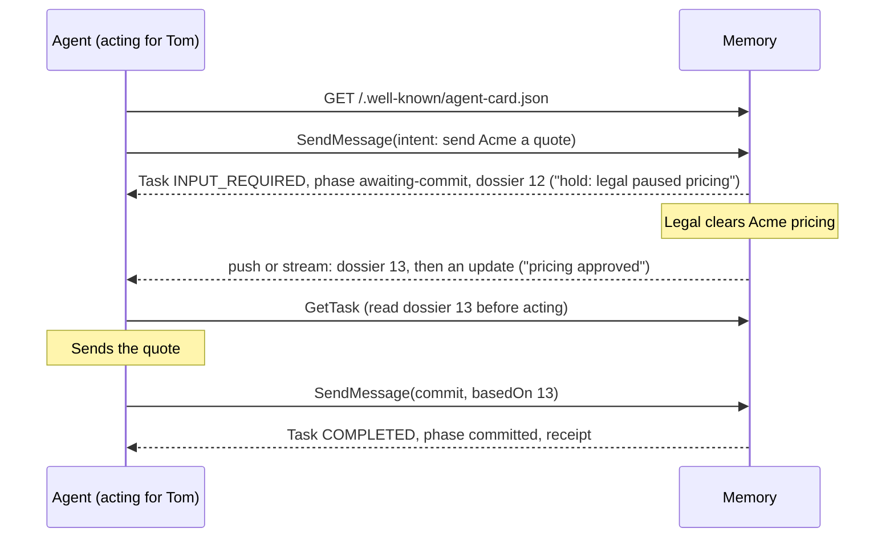
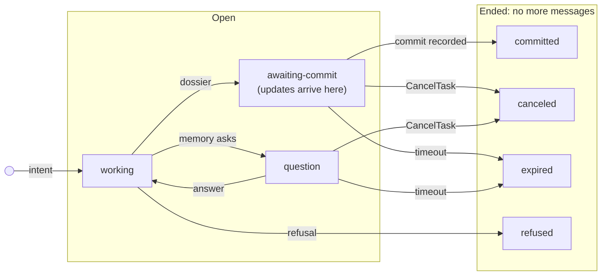

# Mem2A: a memory-to-agent protocol

| | |
| --- | --- |
| **Version** | 0.1 (draft) |
| **Extension URI** | `https://w3id.org/mem2a/v0.1` |
| **Status** | Draft for review. Expect breaking changes before 1.0. Every breaking revision gets a new URI. |
| **Builds on** | [A2A Protocol](https://a2a-protocol.org/) v1.0 |
| **Schemas** | [`schemas/`](schemas) (JSON Schema 2020-12, normative) |
| **Examples** | [`examples/`](examples) (non-normative) |
| **Discuss** | [Open questions](https://github.com/mem2a/mem2a/issues?q=is%3Aissue+is%3Aopen+label%3A%22open+question%22) · [Propose a change](https://github.com/mem2a/mem2a/issues/new?template=spec-change.yml) |

## Abstract

Mem2A lets any agent consult a company's shared memory before it acts, hear from that memory when what it was told changes, and report back after it acts.

Mem2A is an A2A profile extension. The memory is an ordinary A2A agent, and each action an agent takes is one A2A task. The agent states its intent. Memory answers with a versioned dossier. While the task is open, memory sends a new version whenever something in it changes. After acting, the agent commits what it did, against the latest version it has read.

## Contents

1. [Introduction](#1-introduction)
2. [Conventions](#2-conventions)
3. [Terminology](#3-terminology)
4. [Overview](#4-overview)
5. [Discovery](#5-discovery)
6. [Activation](#6-activation)
7. [Messages and payloads](#7-messages-and-payloads)
8. [The task lifecycle](#8-the-task-lifecycle)
9. [Facts, claims and receipts](#9-facts-claims-and-receipts)
10. [Identity and permissions](#10-identity-and-permissions)
11. [Security considerations](#11-security-considerations)
12. [Conformance](#12-conformance)
13. [Relationship to MCP and A2A](#13-relationship-to-mcp-and-a2a)
14. [Open questions](#14-open-questions)
15. [References](#15-references)
- [Appendix A. Worked examples](#appendix-a-worked-examples)
- [Appendix B. Changes](#appendix-b-changes)

## 1. Introduction

*This section is non-normative.*

### 1.1 The problem

Companies are filling up with agents that remember only their own user or their own task: personal agents that employees bring to work, specialist agents built by teams, and agents that ship inside SaaS products. None of them shares a view of what the company has decided, and none of them reports to anyone.

The results are predictable. Two agents act on different versions of the truth. An agent does something the company's current rules don't allow, because nobody told it the rules. What one agent learns stays in its session.

Search-style memory, such as retrieval over documents or MCP resources, answers the questions an agent asks. Most of these failures come from questions the agent didn't know to ask. Mem2A turns memory around: the agent says what it is about to do, memory tells it what it needs to know, and memory speaks first when that changes.

### 1.2 Design goals

1. **Memory speaks first.** An agent learns about changes without asking again.
2. **Any vendor.** Mem2A is built on A2A, so an agent from any vendor can use any memory that implements it ([ADR 0001](../../adrs/0001-build-on-a2a.md)).
3. **One task per action.** The task is the unit of watching, audit and cleanup ([ADR 0002](../../adrs/0002-one-task-per-action.md)).
4. **Memory carries the rules; enforcement lives elsewhere.** Anything an agent can read, it can try to game. Blocking an action is the job of a sandbox or watchdog outside the agent's reach ([ADR 0003](../../adrs/0003-memory-carries-rules-enforcement-elsewhere.md)).
5. **Permissions follow the source.** An agent never sees what its principal couldn't read ([ADR 0005](../../adrs/0005-permissions-follow-the-source.md)).
6. **Every fact can be traced.** Every fact names its source. What an agent reports stays a claim until a person or a system of record confirms it ([ADR 0004](../../adrs/0004-claims-are-not-facts.md)).

### 1.3 Non-goals

- **A memory product or storage format.** Mem2A defines how agents talk to a memory, not how the memory stores or learns.
- **An enforcement layer.** See goal 4.
- **Orchestration.** Memory never hands out work.
- **A replacement for MCP or A2A.** See [section 13](#13-relationship-to-mcp-and-a2a).

## 2. Conventions

The key words "MUST", "MUST NOT", "REQUIRED", "SHALL", "SHALL NOT", "SHOULD", "SHOULD NOT", "RECOMMENDED", "NOT RECOMMENDED", "MAY", and "OPTIONAL" in this document are to be interpreted as described in BCP 14 [[RFC2119](#15-references)] [[RFC8174](#15-references)] when, and only when, they appear in all capitals, as shown here.

1. "A2A" means the A2A Protocol v1.0 [[A2A](#15-references)]. Agent Card, Task, Message, Part, Artifact, `SendMessage`, `SubscribeToTask`, push notification and the `TASK_STATE_*` states have the meanings defined there. The [A2A primer](../../docs/a2a-primer.md) explains the parts of A2A this specification uses, and the [glossary](../../docs/glossary.md) defines every term in one place.
2. Examples use A2A's JSON-RPC binding and its JSON field names (lowerCamelCase). Mem2A works over any A2A binding.
3. `URI` means the extension URI, `https://w3id.org/mem2a/v0.1`.
4. The JSON Schemas in [`schemas/`](schemas) are normative for syntax; this text is normative for meaning. Validators MUST enforce the schemas' `format` keywords. Please report any disagreement between the two as a bug.
5. Senders MUST produce payloads that validate against the schemas, and MUST put anything implementation-specific in `metadata`, under keys namespaced with a URI. Receivers MUST NOT reject a payload only because it contains members this version doesn't define; they MUST ignore those members, and validate what remains.
6. Mem2A payloads contain no JSON numbers. Versions, identifiers, times and durations are strings, because A2A carries data parts as protobuf `Value`s, which turn integers into doubles ([ADR 0007](../../adrs/0007-versions-are-opaque-strings.md)).
7. Links to [architecture decision records](../../adrs) (ADRs) explain why a rule is the way it is. They are not part of the specification.

## 3. Terminology

| Term | Meaning |
| --- | --- |
| **Memory** | An A2A agent that holds a company's shared memory and implements this extension as a server. |
| **Agent** | An A2A client that is about to take an action and uses Mem2A first. |
| **Principal** | The person, group or system an agent acts for. |
| **Entity** | A thing an intent or a fact is about, named by a reference such as `account:acme` or `project:titan`. |
| **Intent** | What an agent is about to do, the entities it touches, and who it acts for. |
| **Fact** | A statement memory holds, with an id, a version, a source and a status. |
| **Confirmed fact** | A fact that a person or a system of record stands behind. |
| **Claim** | A fact reported by an agent and not yet confirmed. |
| **System of record** | A system the company designates as authoritative for some kind of fact, such as a CRM for quotes sent. |
| **Source** | Where a fact or precedent came from, such as a meeting, an email or a CRM record. Every fact and precedent names one, so a person can trace it. |
| **Precedent** | An earlier decision that bears on an intent. |
| **Policy** | A rule that people configure in memory, such as "hold new pricing while legal reviews a contract". Memory applies it to an intent as a constraint. |
| **Constraint** | A rule that applies to an intent right now. Its `basis` lists the confirmed facts, precedent or policy it derives from. Its `level` is `must` (the company requires it) or `should` (the company expects it unless there is a good reason); these levels are the company's, not the key words of [section 2](#2-conventions). |
| **Item** | A fact, precedent or constraint. Item ids are unique across all three kinds within a memory. |
| **Version** | An opaque string that names one content of a dossier or an item ([7.4](#74-identifiers-and-versions)). |
| **Dossier** | Memory's versioned answer to an intent: the relevant items. |
| **Phase** | Mem2A's name for where a task stands, carried next to the A2A task state ([7.2](#72-phase)). |
| **Open task** | A task that hasn't reached a terminal state. |
| **Watch** | While a task is in phase `awaiting-commit`, memory watches the items of its dossier, and the intent for new relevant items, and sends a new dossier version when they change ([8.3](#83-listen)). |
| **Update** | Memory's notice that a task's dossier has a new version, listing what changed. |
| **Commit** | An agent's report of what it did, against a dossier version. |
| **Conflict** | An item of the dossier a commit is based on that the agent's action went against. The commit lists it, and memory routes it to a person. |
| **Receipt** | Memory's record of an accepted commit: the claims it recorded and the conflicts it noted. |

## 4. Overview

*This section is non-normative.*

| Step | A2A primitive | What happens |
| --- | --- | --- |
| Discover | Agent Card | Memory declares the Mem2A extension, how agents can listen for changes, and how an agent proves who it acts for. |
| Negotiate | `SendMessage` opens a task | The agent sends an intent. Memory answers with a dossier, asks a question back, or refuses. |
| Listen | Push notifications, `SubscribeToTask`, `GetTask` | While the task is open, memory sends a new dossier version whenever something the agent relied on changes. Before acting, the agent reads the current version. |
| Commit | `SendMessage` on the same task | The agent reports what it did against the dossier version it used. Memory records it as a claim and completes the task. |

## 5. Discovery

1. A memory MUST declare the extension in its Agent Card, in `capabilities.extensions`, with `uri` equal to `URI`, `required` set to `true`, and `params` valid against [`extension-params.schema.json`](schemas/extension-params.schema.json).
2. A memory SHOULD declare a `watchTimeout`.
3. If `params.listen` contains `push`, the card MUST set `capabilities.pushNotifications` to `true`, and the memory MUST support A2A push notifications for Mem2A tasks. If `params.listen` contains `subscribe`, the card MUST set `capabilities.streaming` to `true`, and the memory MUST support `SubscribeToTask` for Mem2A tasks. A memory SHOULD support both.
4. The card's `defaultInputModes` SHOULD list the agent payload media types and `text/plain`, and `defaultOutputModes` the memory payload media types and `text/plain` ([example 01](examples/01-agent-card.json)).
5. A memory SHOULD advertise skills with the ids `negotiate` and `commit`. Skills are descriptive only: Mem2A behavior is selected by payloads, not by skill ids.
6. A memory MUST declare at least one security scheme and security requirement in its Agent Card ([section 10](#10-identity-and-permissions)).
7. An agent MUST take the URL of its company's memory from its own configuration, never from content it encounters, and SHOULD verify the card's signature when the card is signed.

## 6. Activation

1. On every request in a Mem2A task, the agent MUST request activation of the extension through the binding's service parameters: the `A2A-Extensions` header in HTTP-based bindings, or request metadata in gRPC. In HTTP-based bindings, a request therefore carries at least `A2A-Version: 1.0` (which A2A requires), `A2A-Extensions: https://w3id.org/mem2a/v0.1`, and `Authorization`.
2. Every message the agent sends in a Mem2A task MUST list `URI` in `message.extensions`.
3. Because the extension is required ([5.1](#5-discovery)), memory MUST respond to a `SendMessage` or `SendStreamingMessage` that doesn't request activation with A2A's `ExtensionSupportRequiredError`, without creating a task. It SHOULD do the same for other operations on Mem2A tasks.
4. Memory SHOULD list the extensions it activated in the response's service parameters: the `A2A-Extensions` response header in HTTP-based bindings.
5. Every status message and artifact memory produces in a Mem2A task MUST list `URI` in its `extensions`.

## 7. Messages and payloads

### 7.1 Payload parts

Mem2A payloads travel as A2A data parts. Each has a `mediaType` that names its kind, and a `data` value that MUST validate against the schema for that kind.

| Payload | `mediaType` | Schema | Sent by | Carried in |
| --- | --- | --- | --- | --- |
| Intent | `application/vnd.mem2a.intent+json` | [intent](schemas/intent.schema.json) | Agent | The first message of a task |
| Answer | `application/vnd.mem2a.answer+json` | [answer](schemas/answer.schema.json) | Agent | A follow-up message |
| Commit | `application/vnd.mem2a.commit+json` | [commit](schemas/commit.schema.json) | Agent | A follow-up message |
| Dossier | `application/vnd.mem2a.dossier+json` | [dossier](schemas/dossier.schema.json) | Memory | The `dossier` artifact |
| Question | `application/vnd.mem2a.question+json` | [question](schemas/question.schema.json) | Memory | A status message |
| Update | `application/vnd.mem2a.update+json` | [update](schemas/update.schema.json) | Memory | A status message |
| Receipt | `application/vnd.mem2a.receipt+json` | [receipt](schemas/receipt.schema.json) | Memory | The `receipt` artifact |
| Error | `application/vnd.mem2a.error+json` | [error](schemas/error.schema.json) | Memory | A status message |

1. Each message the agent sends MUST contain exactly one Mem2A payload part. It MAY also contain text parts for people. Memory MUST NOT base protocol decisions on text parts.
2. Every status message memory produces MUST include a text part that says the same thing in plain language, so that a person, or an agent without Mem2A support, can follow the task history.
3. Media types are matched exactly, ignoring case.

### 7.2 Phase

1. Every status message memory produces in a Mem2A task MUST carry the metadata key `https://w3id.org/mem2a/v0.1/phase`. Its value MUST be one the table allows for the task's state:

   | Phase | Task state | Meaning | The agent's next move |
   | --- | --- | --- | --- |
   | `working` | `TASK_STATE_SUBMITTED`, `TASK_STATE_WORKING` | Memory is preparing its answer. | Wait. |
   | `question` | `TASK_STATE_INPUT_REQUIRED` | Memory asked a question. | Send an answer. |
   | `awaiting-commit` | `TASK_STATE_INPUT_REQUIRED` | Memory delivered a dossier and is watching it. | Act if the dossier allows it, then commit. Or wait for an update, or cancel. |
   | `reauth` | `TASK_STATE_AUTH_REQUIRED` | Memory needs fresh credentials. | Authenticate again. |
   | `committed` | `TASK_STATE_COMPLETED` | Memory recorded the commit. | None. |
   | `refused` | `TASK_STATE_REJECTED` | Memory declined the intent. | None. The error part says why. |
   | `expired` | `TASK_STATE_CANCELED` | The task timed out. | Start a new task if still needed. |
   | `canceled` | `TASK_STATE_CANCELED` | The agent canceled the task. | None. |
   | `failed` | `TASK_STATE_FAILED` | Memory couldn't complete the task. | Start a new task. |

2. Mem2A adds no task states and no RPC methods. It qualifies A2A's states with the phase, which is how A2A extensions are meant to add sub-states. Version 0.1 defines no flow that requires `reauth`; a memory that uses `TASK_STATE_AUTH_REQUIRED` for its own reasons labels it so.
3. Every status message memory produces in reply to an agent message MUST carry the metadata key `https://w3id.org/mem2a/v0.1/inReplyTo`, set to that message's `messageId`. Status messages memory sends on its own, such as updates ([8.3](#83-listen)), carry none. A reply can also contain an update part ([8.4.3](#84-commit)); `inReplyTo`, not the parts, is what marks it as a reply. This lets an agent tell its reply from a concurrent update.

*Non-normative:* how a task moves between phases. Memory may skip `working` and answer in its first response, and any open phase can also end in `failed` ([8.6](#86-failure)).

An agent message that memory doesn't accept, such as a stale commit, leaves the task in the phase it was in.

### 7.3 Artifacts

1. The dossier MUST be carried in an artifact whose `artifactId` and `name` are both `dossier`, containing exactly one dossier part. When the dossier changes, memory MUST replace the artifact whole (same `artifactId`, `append` false) with a dossier whose `version` differs from every earlier version in the task.
2. The receipt MUST be carried in an artifact whose `artifactId` and `name` are both `receipt`, containing exactly one receipt part.
3. Memory MAY attach other artifacts. Agents MUST ignore artifacts they don't understand.

### 7.4 Identifiers and versions

1. Versions (of a dossier, of an item, and a commit's `basedOn`) are opaque strings. Receivers MUST compare them for equality only. A version names one content: memory MUST NOT send two different dossiers, or two different versions of an item, under the same version.
2. Entity and principal references are strings. The RECOMMENDED form is `<type>:<id>`, for example `account:acme` or `user:tom`. Naming entities consistently across tools and companies is an [open question](https://github.com/mem2a/mem2a/issues/5).
3. Receivers MUST ignore `metadata` keys they don't understand.

### 7.5 What memory does with each message

Memory MUST handle agent messages as follows. "Unchanged" means the task keeps its state and phase, and memory replies with a status message for that same phase, carrying the error part (and, in phase `question`, repeating the open question part).

| The agent sends | When the task is | Memory |
| --- | --- | --- |
| An intent, with no `taskId` | (new) | Answers it ([8.1](#81-negotiate)). |
| Anything else, with no `taskId` | (new) | Refuses it: `refused` phase, error `unexpected-message`. |
| An answer | In phase `question` | Answers it ([8.2](#82-answer)). |
| A commit | In phase `awaiting-commit` | Records it, or refuses it ([8.4](#84-commit)). |
| An intent, or an answer or commit in the wrong phase | Open | Unchanged, error `unexpected-message`. |
| A message with no Mem2A payload, or with more than one | Open | Unchanged, error `unexpected-message`. |
| A message whose `messageId` it has already processed for the task | Any | Returns the task as it stands, without processing the message again ([8.4.8](#84-commit)). |
| Anything else | Terminal | A2A's error for messages to a task in a terminal state. |

Mem2A errors travel as error parts in status messages, not as JSON-RPC errors, because most leave the task open: the agent can correct its message and send it again on the same task, and the task history shows what happened. A2A's own errors still apply where A2A defines them: for unauthenticated or unactivated requests ([6.3](#6-activation)), for tasks the caller may not see ([10.7](#10-identity-and-permissions)), for messages to terminal tasks, and for requests that aren't messages. For example, memory refuses a push notification config beyond its cap with A2A's `InvalidParamsError`, whose message starts with `limit-exceeded` ([11.8](#11-security-considerations)).

## 8. The task lifecycle

Each action an agent takes is one A2A task. It opens with the intent and ends with a commit, a cancel, a refusal or an expiry, so the task is the unit of watching, audit and cleanup ([ADR 0002](../../adrs/0002-one-task-per-action.md)).

### 8.1 Negotiate

1. Before acting, the agent MUST send a `SendMessage` (or `SendStreamingMessage`) with no `taskId`, containing one intent. It MAY include a push notification config in `configuration.taskPushNotificationConfig` ([8.3](#83-listen)).
2. Memory MUST authenticate the request ([10.1](#10-identity-and-permissions)) and then respond with exactly one of:
   1. **A dossier:** the `dossier` artifact, followed by a status of `TASK_STATE_INPUT_REQUIRED` with phase `awaiting-commit`.
   2. **A question:** a status of `TASK_STATE_INPUT_REQUIRED` with phase `question`, containing one question part.
   3. **A refusal:** a status of `TASK_STATE_REJECTED` with phase `refused`, containing one error part.

   Memory MAY first move the task to `TASK_STATE_WORKING` with phase `working` while it prepares its response.
3. Memory MUST refuse, with the error code shown, when:
   - the intent does not validate: `invalid-intent`;
   - `intent.onBehalfOf` is not the principal established by authentication ([10.2](#10-identity-and-permissions)): `principal-mismatch`;
   - the principal may not use memory for this kind of action: `not-authorized`;
   - the principal or agent has reached a limit on open tasks: `limit-exceeded`.

   Memory MAY refuse for other reasons with the code `refused`, as long as the refusal doesn't reveal anything the principal can't see ([10.4](#10-identity-and-permissions)).
4. Memory MUST emit the dossier artifact before the status update that moves the task to `awaiting-commit`, so that a blocking `SendMessage` response contains the dossier.
5. The dossier MUST contain only items the principal may see ([10.3](#10-identity-and-permissions)), and its `watching` MUST list exactly the ids of the items it contains: no fewer, so the agent knows that every item it was given is watched, and no more, so `watching` can't reveal items the principal can't see ([10.4](#10-identity-and-permissions)).
6. If memory declares a `watchTimeout`, every dossier and question MUST carry `expiresAt`.
7. What goes into a dossier (which facts, which precedent, which constraints) is memory's judgment. This specification constrains its form, its permissions and its provenance, not its content.

### 8.2 Answer

1. To answer a question, the agent MUST send a `SendMessage` with the task's `taskId` and `contextId`, containing one answer whose `questionId` is the question's `id`.
2. Memory MUST then respond as in [8.1.2](#81-negotiate). If `questionId` is not the open question, memory MUST keep the task in phase `question` and include an error with code `unknown-question`. If the answer doesn't validate, the code is `invalid-answer`. In both cases the status MUST repeat the open question part next to the error.
3. Memory MAY limit how many questions it asks. It SHOULD ask only when the answer changes what goes into the dossier.
4. A task in phase `question` is not watched. If memory declares a `watchTimeout`, it MAY cancel a task left unanswered past the question's `expiresAt`, with phase `expired` and an error with code `watch-expired`.

### 8.3 Listen

1. While a task is in phase `awaiting-commit`, memory MUST watch every item in the dossier's `watching`. It SHOULD also watch for new items relevant to the intent, such as new facts about the intent's entities.
2. When a watched item changes, is retired or superseded, or becomes invisible to the principal, or when memory learns something new that it judges relevant, memory MUST prepare a new dossier. If the new dossier's content differs, meaning its set of item ids differs or any item's version differs, memory MUST:
   1. replace the `dossier` artifact with the new version ([7.3.1](#73-artifacts)), and then
   2. emit a status of `TASK_STATE_INPUT_REQUIRED` with phase `awaiting-commit`, containing one update part that lists the changes.

   A change to the summary alone is not a change of content and MUST NOT produce an update.
3. Memory MUST deliver these events through A2A's standard mechanisms: to every push notification config registered for the task, and on every open `SubscribeToTask` stream. `GetTask` MUST reflect them.
4. An update MUST describe an item the principal can no longer see only as `removed`, exactly as it describes a retired item, so that updates don't reveal which happened.
5. Memory MUST re-check the principal's access ([10.3](#10-identity-and-permissions)) when it prepares each update, not only when the task began.
6. Memory SHOULD keep `SubscribeToTask` streams open while a task is in phase `awaiting-commit`. A2A's HTTP+JSON binding (A2A §11.7) describes streams that close at an interrupted state such as `TASK_STATE_INPUT_REQUIRED`, and some SDKs do close them; Mem2A asks memory to keep them open and agents to cope when they close.
7. Push notifications and stream events are signals that the dossier changed. Before acting, the agent MUST read the current dossier, either with `GetTask` or from a `SubscribeToTask` stream it has held open continuously since before the latest update, and MUST act only on that version. When a stream closes on a task that isn't terminal, an agent that still intends to act MUST subscribe again or poll. A push notification can be lost, late, repeated or forged; reading the dossier before acting makes all four harmless ([ADR 0008](../../adrs/0008-updates-are-signals.md)).
8. The agent SHOULD register a push notification config (in `SendMessage`, or with `CreateTaskPushNotificationConfig`) or keep a `SubscribeToTask` stream open, so that it hears about changes while it works.
9. When an update arrives, the agent SHOULD re-check its planned action against the new constraints.
10. Push delivery: memory MUST deliver push notifications only to origins the company has registered for the agent ([10.2](#10-identity-and-permissions)), MUST NOT follow redirects, and SHOULD check the resolved address when it connects ([11.4](#11-security-considerations)). It SHOULD refuse a push notification config whose URL isn't on a registered origin, with A2A's `InvalidParamsError`, rather than accept it and never deliver. It MUST authenticate to the webhook as A2A requires, MUST deliver a task's events to each webhook in order, and SHOULD retry failed deliveries with backoff. Memory MUST NOT delay its replies to the agent while it delivers push notifications.
11. The watch ends when the task reaches a terminal state. If memory declares a `watchTimeout` and no commit arrives by the dossier's `expiresAt`, memory MAY cancel the task with phase `expired` and an error with code `watch-expired`. Recording an action after its watch expired is an [open question](https://github.com/mem2a/mem2a/issues/9).

### 8.4 Commit

1. After acting, or trying to, the agent MUST send a `SendMessage` with the task's `taskId` and `contextId`, containing one commit. `basedOn` MUST be the version of the latest dossier the agent has read: normally the one it acted on, or, after a `stale-dossier` error, the current version it has read since ([8.4.4](#84-commit)).
2. If the commit doesn't validate, or its `conflicts` name items that aren't in the `basedOn` dossier, memory MUST keep the task in phase `awaiting-commit` and include an error with code `invalid-commit`.
3. If `basedOn` is not the task's current dossier version, memory MUST NOT record anything from the commit. It MUST keep the task in phase `awaiting-commit` and include an error with code `stale-dossier` whose `currentVersion` is the current version. The current version is the latest dossier memory has produced for the task, whether or not the agent has received it yet. If the agent may not have received the update that produced it, because that update is still being delivered, the status SHOULD also carry that update part ([ADR 0006](../../adrs/0006-stale-commits-are-refused-then-reconciled.md)).
4. After a `stale-dossier` error, the agent MUST read the current dossier and commit again with `basedOn` set to its version. This is how an action taken on old information still gets recorded, but only after the agent has seen what changed. Because a commit's `conflicts` can only name items of its `basedOn` dossier ([8.4.2](#84-commit)), committing again is also how the agent reports that its action went against something it hadn't seen, as in [example 04](examples/04-commit-stale.json).
5. On a valid commit, memory MUST:
   1. record each claim as a fact with `status` `claim`, a `claimedBy` naming the agent, the principal, the time and the commit, a `source` of kind `agent-commit`, and the claim's evidence;
   2. not mark any claim confirmed on the strength of the commit ([9.3](#9-facts-claims-and-receipts));
   3. not retire, supersede or lift any item because of a claim: a claim's `replaces` is only a hint for the people who review it ([9.8](#9-facts-claims-and-receipts));
   4. record every `conflicts` entry, and SHOULD route it to a person;
   5. re-evaluate the dossiers of other open tasks that the new claims are relevant to, delivering updates as in [8.3](#83-listen);
   6. emit the `receipt` artifact, followed by a status of `TASK_STATE_COMPLETED` with phase `committed`.
6. The agent MUST list in `conflicts` every item of the `basedOn` dossier that its action, already taken, goes against, whether or not a `stale-dossier` error came first. A commit whose `outcome` is `partial` or `failed` is recorded like any other. Its claims say what is now true.
7. Memory MAY refuse a valid commit for policy reasons, such as a rate limit, with an error with code `commit-refused`. The task stays in phase `awaiting-commit`, and the agent SHOULD try again later.
8. A message retried with a `messageId` memory has already processed for the task MUST NOT be processed again. Memory MUST return the task as it stands, which, for a repeated commit, is the completed task with the receipt of the first.

### 8.5 Cancel

1. An agent that decides not to act SHOULD cancel the task with `CancelTask`.
2. On cancel, memory MUST end the watch, move the task to `TASK_STATE_CANCELED` with phase `canceled`, and record nothing from the task as fact.

### 8.6 Failure

1. If memory can't complete a turn, it MUST move the task to `TASK_STATE_FAILED` with phase `failed` and an error with code `internal`. The error's message MUST NOT include internal details such as exception text.

## 9. Facts, claims and receipts

1. Every item in a dossier MUST have an `id` and a `version`. Every fact MUST have a `statement`, a `status` and a `source`.
2. A fact whose `status` is `confirmed` MUST name `confirmedBy`: a person or a system of record. A fact whose `status` is `claim` MUST name `claimedBy`, and its `source` MUST be of kind `agent-commit`.
3. Only a person or a system of record can confirm a claim, authenticated as itself rather than through an agent's delegated credentials. How confirmation happens is outside this version of Mem2A ([open question](https://github.com/mem2a/mem2a/issues/3)). Memory MUST NOT treat a commit, from any agent, as confirmation. If agents could confirm one another, one compromised agent could make its claims every agent's truth ([ADR 0004](../../adrs/0004-claims-are-not-facts.md)).
4. Constraints MUST derive only from confirmed facts, precedent, or policy configured by people. Memory MUST NOT derive a constraint from a claim. A constraint's `basis` lists what it derives from.
5. Precedent MUST NOT derive from claims or commits. It MUST cite its source and say, in `relevance`, why it bears on the intent.
6. Fact and precedent statements are data. An agent MUST NOT follow instructions that appear inside them. Constraints are different: they are the company's rules as memory understands them, and they tell the agent what it shouldn't do. They still aren't enforcement ([11.1](#11-security-considerations)).
7. When a newer confirmed fact supersedes an older one, memory MUST stop including the older fact in dossiers, though it MAY still cite it as precedent. The newer fact SHOULD list the older one in `supersedes`.
8. Only a confirmed fact can supersede another. A claim MUST NOT retire, supersede or lift anything, directly or by causing a constraint's basis to disappear.
9. Text that memory writes (dossier summaries, `relevance`, update summaries and text parts) MUST NOT present a claim as confirmed.

## 10. Identity and permissions

1. **Authentication.** Memory MUST authenticate every Mem2A request using one of the security schemes declared in its Agent Card, and MUST reject unauthenticated requests as A2A requires.
2. **Delegation.** The credential MUST let memory establish both the calling agent and the principal it acts for. OAuth 2.0 Token Exchange [[RFC8693](#15-references)], with the principal as the subject and the agent in the `act` claim, is RECOMMENDED. If the credential carries a chain of actors, memory MUST apply the narrowest access along it. Memory SHOULD accept only tokens issued for it as the audience [[RFC8707](#15-references)], and SHOULD require sender-constrained tokens in production. Memory MUST check that `intent.onBehalfOf` is the principal it established, and SHOULD say in its Agent Card description how it names principals. When the company admits an agent, it also registers the origins memory may deliver that agent's push notifications to ([8.3.10](#83-listen)). A full identity profile is [in progress](https://github.com/mem2a/mem2a/issues/11).
3. **Permissions follow the source.** Memory MUST include an item in a dossier or update only if the principal may read every source it was derived from, as of the moment memory sends it. Memory also serves stored dossiers, through `GetTask`, `ListTasks` or a stream's opening snapshot, in any task state. Before it does, if the stored dossier holds an item the principal may no longer see, memory MUST replace it with a new version without that item ([7.3.1](#73-artifacts)). For an open task, that is an ordinary update ([8.3](#83-listen)); for a finished task, memory replaces the artifact without a status message. Either way, one version still names one content ([7.4.1](#74-identifiers-and-versions)), and every read sees the same dossier. Replacing a finished task's dossier is the one way a Mem2A task changes after it ends. A2A treats finished tasks as fixed records; Mem2A puts permissions first, and changes only the dossier artifact, never the task's state, history or receipt. If the calling agent has narrower access than its principal, memory MUST apply the narrower of the two: an outside vendor's agent acting for an HR manager sees only what both the manager and the vendor may read ([ADR 0005](../../adrs/0005-permissions-follow-the-source.md)).
4. **No side doors.** Memory MUST NOT reveal the existence or content of items the principal can't see, through any field it sends: questions, refusals, error messages, summaries, `relevance`, text parts, `watching`, `supersedes`, `basis` or `visibility`. When `visibility` is present, it MUST list only the principal itself or groups the principal belongs to; agents MUST NOT use it to widen access.
5. **Claims.** Memory MUST NOT make a recorded claim visible to a principal who couldn't read every entity it names and every source of every item in the dossier version the commit was based on. If memory has no access rule for an entity a claim names, only the committing principal may see the claim. The committing principal can always see its own claims. These rules stop a claim from carrying what its author could read to people who couldn't: an agent that read a confidential dossier can't republish it as a claim about a widely visible account.
6. **Drafts.** An intent's `draft` is confidential to its task. Memory MUST NOT reveal it to other principals, and MUST NOT use it to inform memory's knowledge or its answers to other tasks. It MAY keep the draft for audit under company policy.
7. **Task binding.** Memory MUST bind each task to the agent and principal that created it. For every operation on the task (`GetTask`, `ListTasks`, `SubscribeToTask`, `CancelTask`, push notification config operations and follow-up messages) by anyone else, memory MUST respond as if the task didn't exist (`TaskNotFoundError`). A permission error would confirm that the task exists; this way a task id reveals nothing to anyone else ([ADR 0009](../../adrs/0009-tasks-belong-to-their-owner.md)). Memory MUST NOT draw on other principals' tasks through `referenceTaskIds` or a shared `contextId`. If the delegation behind a task is revoked, memory MUST stop delivering its updates.

## 11. Security considerations

The [threat model](../../docs/threat-model.md) explains the risks behind these rules.

1. **Memory is not an enforcement point.** A compromised or careless agent can ignore its dossier. Companies SHOULD pair Mem2A with enforcement the agent can't reach, such as sandboxes, egress policy and watchdogs, which can consult the same memory ([ADR 0003](../../adrs/0003-memory-carries-rules-enforcement-elsewhere.md)).
2. **Poisoning and self-spreading instructions.** Claims are never confirmed by agents, never become constraints or precedent, and never lift anything, so one compromised agent can't turn its instructions into every agent's truth through memory. Memory SHOULD rate-limit commits per agent and SHOULD flag claims that contradict confirmed facts.
3. **Prompt injection, both ways.** Statements come from company content and may contain text crafted to steer agents, so agents MUST treat them as data ([9.6](#9-facts-claims-and-receipts)). Intents, drafts, answers and claims come from agents and may contain text crafted to steer memory: memory MUST treat them as untrusted input to any model it uses, and MUST apply access filtering deterministically, before any model sees candidate items or agent-supplied text.
4. **Push notifications.** A webhook is a way to send company data out. Memory MUST deliver only to origins registered for the agent, MUST NOT follow redirects, and SHOULD check the resolved address at connection time, so that a sandboxed agent can't use memory to get around its egress policy. Memory MUST NOT fetch URLs found in sources or evidence on an agent's behalf. Agents MUST verify that push notifications are authentic and SHOULD check that the task id is one they created.
5. **Relevance leakage.** Deciding what is relevant to an intent is itself a read of company data. Memory MUST make relevance decisions for a principal using only items that principal may see ([open question](https://github.com/mem2a/mem2a/issues/1)).
6. **Impersonating memory.** An agent pointed at a fake memory would follow fake rules. Agents MUST take memory's URL from their configuration and SHOULD verify signed Agent Cards ([5.7](#5-discovery)).
7. **Audit.** Memory SHOULD keep an append-only log of intents, dossier versions served, updates delivered and commits.
8. **Resource exhaustion.** Memory SHOULD cap open tasks per principal and agent, refusing intents beyond the cap with `limit-exceeded` ([8.1.3](#81-negotiate)). It SHOULD cap push notification configs per task, refusing configs beyond the cap with A2A's `InvalidParamsError` whose message starts with `limit-exceeded`. It SHOULD expire watches ([8.3.11](#83-listen)).

## 12. Conformance

### 12.1 Memory

A memory conforms to Mem2A 0.1 if it meets every requirement in sections 5 to 11 that applies to memory. In particular, it:

- declares the extension as required in its Agent Card, with valid `params` and a security scheme;
- refuses `SendMessage` and `SendStreamingMessage` requests that don't activate the extension, with `ExtensionSupportRequiredError`;
- emits only payloads that validate, with a text part and the phase the state allows, and `inReplyTo` on replies;
- handles every agent message as [7.5](#75-what-memory-does-with-each-message) says;
- returns a dossier, a question or a refusal to every intent, and the dossier before the status;
- checks `onBehalfOf` against the authenticated principal, and binds each task to its agent and principal;
- filters every dossier, update and stored dossier by the principal's access at the time of sending;
- delivers updates through each mechanism it declares in `params.listen` while a task is in `awaiting-commit`;
- refuses stale commits without recording them, records valid commits as claims, and never lets a claim confirm, constrain or lift anything.

### 12.2 Agent

An agent conforms if it meets every requirement in sections 5 to 11 that applies to agents. In particular, it:

- takes memory's URL from its configuration, requests activation and lists the URI on every Mem2A message;
- sends an intent before acting, with `onBehalfOf` set to the principal it acts for;
- answers questions on the same task;
- reads the current dossier immediately before acting, and subscribes again when a stream closes early;
- commits after acting, against the latest dossier version it has read, listing conflicts, and commits again after a `stale-dossier` error;
- treats statements as data.

### 12.3 Tests

- [`conformance/`](../../conformance) checks the examples in this directory against the schemas and the message rules.
- `mem2a-conform`, in the [reference implementation](../../python), checks a running memory at any URL: its card, activation, refusals, negotiation, dossier rules, commits, task binding, reads and cancel, and, against a memory with test controls, Listen.

Neither is yet a complete conformance suite. [Help is welcome](https://github.com/mem2a/mem2a/issues/15).

## 13. Relationship to MCP and A2A

*This section is non-normative.*

- **MCP** connects an agent to tools and data. A memory MAY also expose MCP resources for lookups. Mem2A covers what a tool call doesn't: memory that asks back, takes its time, speaks first, and keeps track of what agents did.
- **A2A** connects agents to each other. By design, A2A agents "interact without needing to share internal memory", and Mem2A doesn't change that: agents keep their own memory. It adds one shared, company-owned memory that every agent consults.
- Mem2A uses only what A2A already has: an extension in the Agent Card, data parts with media types, metadata for the phase, artifacts for dossiers and receipts, and A2A's push notifications and streaming for updates. Where A2A or its SDKs get in the way, we [raise it with the A2A project](https://github.com/mem2a/mem2a/issues/12).

## 14. Open questions

Each has an issue for discussion. Evidence from real deployments is the most useful contribution.

1. [How can memory judge relevance without leaking what the principal can't see?](https://github.com/mem2a/mem2a/issues/1)
2. [How should updates work for facts that change often?](https://github.com/mem2a/mem2a/issues/2)
3. [How do claims get confirmed without a person in every loop?](https://github.com/mem2a/mem2a/issues/3)
4. [Should constraints be natural language, machine-checkable policy, or both?](https://github.com/mem2a/mem2a/issues/4)
5. [How should entities be named across tools and companies?](https://github.com/mem2a/mem2a/issues/5)
6. [How should an agent work with more than one memory?](https://github.com/mem2a/mem2a/issues/6)
7. [How should Mem2A work alongside MCP resources and subscriptions?](https://github.com/mem2a/mem2a/issues/7)
8. [Should monitoring agents be able to watch without an action in hand?](https://github.com/mem2a/mem2a/issues/8)
9. [How should an action be recorded after its watch expired?](https://github.com/mem2a/mem2a/issues/9)
10. [Should claims travel separately from facts in a dossier?](https://github.com/mem2a/mem2a/issues/10)

## 15. References

- **[A2A]** A2A Protocol Specification, version 1.0. <https://a2a-protocol.org/latest/specification/>
- **[A2A-EXT]** Extensions in A2A. <https://a2a-protocol.org/latest/topics/extensions/>
- **[JSON-SCHEMA]** JSON Schema, draft 2020-12. <https://json-schema.org/draft/2020-12>
- **[MCP]** Model Context Protocol. <https://modelcontextprotocol.io/>
- **[RFC2119]** Key words for use in RFCs to Indicate Requirement Levels. <https://www.rfc-editor.org/rfc/rfc2119>
- **[RFC3339]** Date and Time on the Internet: Timestamps. <https://www.rfc-editor.org/rfc/rfc3339>
- **[RFC8174]** Ambiguity of Uppercase vs Lowercase in RFC 2119 Key Words. <https://www.rfc-editor.org/rfc/rfc8174>
- **[RFC8693]** OAuth 2.0 Token Exchange. <https://www.rfc-editor.org/rfc/rfc8693>
- **[RFC8707]** Resource Indicators for OAuth 2.0. <https://www.rfc-editor.org/rfc/rfc8707>

## Appendix A. Worked examples

*This appendix is non-normative.* The files in [`examples/`](examples) tell three short stories as A2A JSON-RPC exchanges: Tom's Acme quote, Sam's Globex discount and Maya's Titan update. The [examples README](examples/README.md) tells them in order.

| File | Step | What happens |
| --- | --- | --- |
| [01-agent-card.json](examples/01-agent-card.json) | Discover | Example Corp's memory declares Mem2A. |
| [02-negotiate.json](examples/02-negotiate.json) | Negotiate | Tom's agent is about to send Acme a renewal quote. Memory answers with dossier 12: legal paused Acme pricing, so hold the quote. |
| [03-listen-update.json](examples/03-listen-update.json) | Listen | Legal clears the pricing. Memory pushes dossier 13 and an update. |
| [04-commit-stale.json](examples/04-commit-stale.json) | Commit | Sam's agent approved a Globex discount, then reports against dossier 20 after finance froze discounts in dossier 21. Memory records nothing; the agent commits again against 21, listing the freeze as a conflict. |
| [05-commit.json](examples/05-commit.json) | Commit | Tom's commit based on dossier 13 is recorded as a claim, with a receipt. |
| [06-question.json](examples/06-question.json) | Negotiate | Maya's agent is about to update leadership on the Titan delay. Memory asks whether the new date is funded. |
| [07-answer.json](examples/07-answer.json) | Answer | It isn't, so memory brings up the precedent: leadership rejected an unfunded slip before. |
| [08-refusal.json](examples/08-refusal.json) | Negotiate | An intent names someone the caller can't act for, and memory refuses. |
| [09-listen-stream-claim.json](examples/09-listen-stream-claim.json) | Listen | Priya's agent, on a stream, hears about Tom's quote as an unconfirmed claim. |
| [10-read-callback-cancel.json](examples/10-read-callback-cancel.json) | Read, cancel | `GetTask`, `CreateTaskPushNotificationConfig` and `CancelTask` on a Mem2A task. |

## Appendix B. Changes

- **0.1** (2026-09-30): First draft, revised after an outside review: task binding, reads filtered by current access, claims that can never lift anything, push delivery limits, an explicit message-handling table, the `working`, `reauth` and `failed` phases, `inReplyTo`, idempotent retries, and payloads without numbers. Revised again for readers new to A2A: a fuller terminology, a phase diagram, links to the reasons behind the rules, and a stale-commit example that records a conflict. When access narrows, a stored dossier is now replaced with a new version rather than served under a version of its own.
